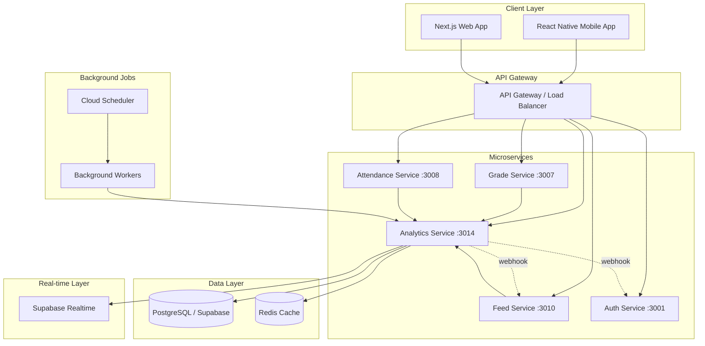
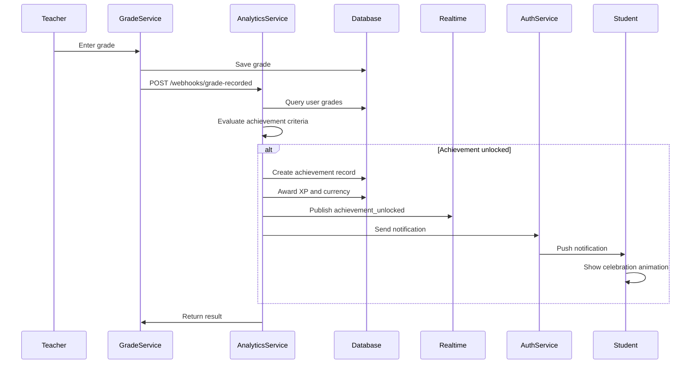
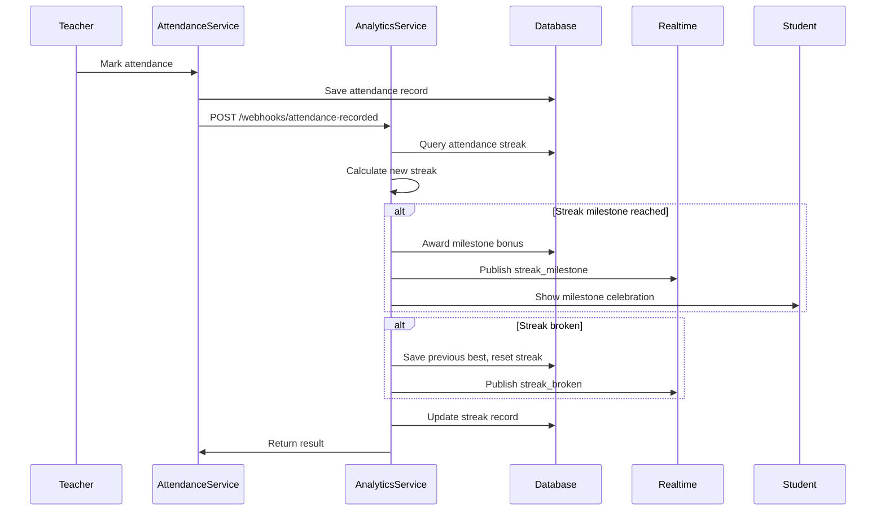
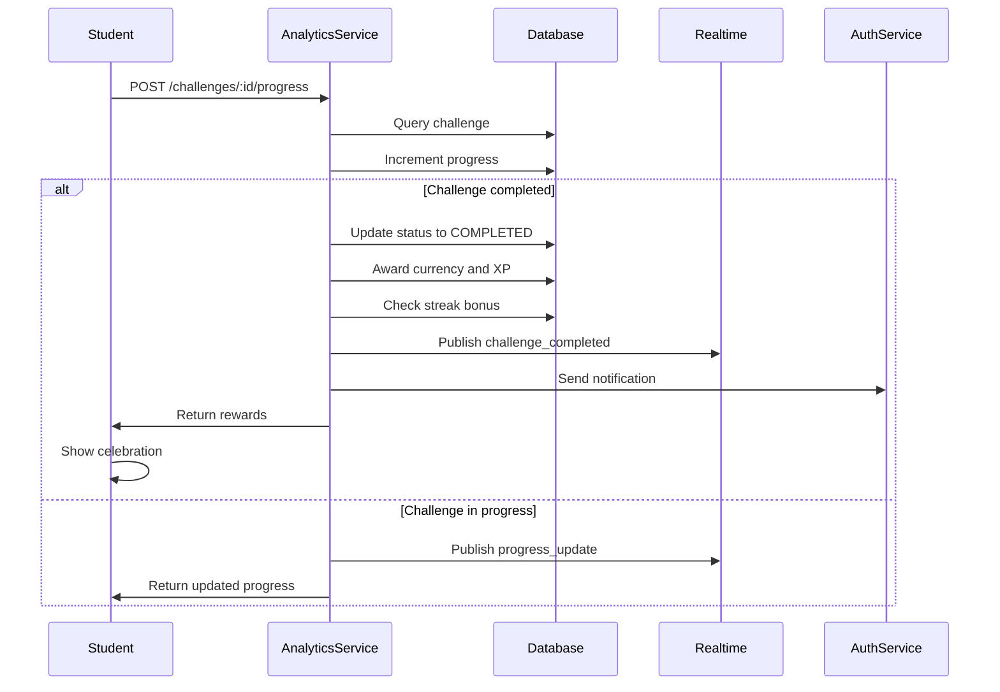
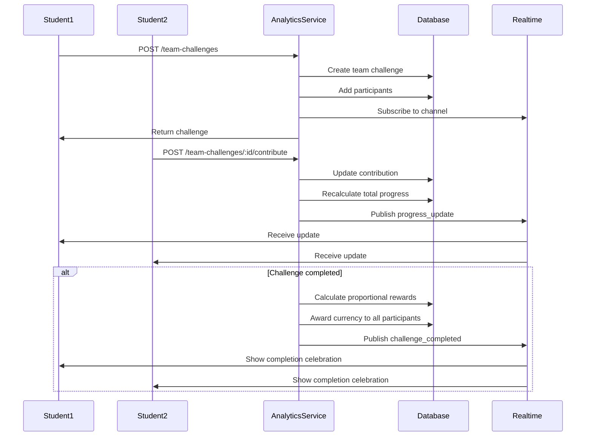
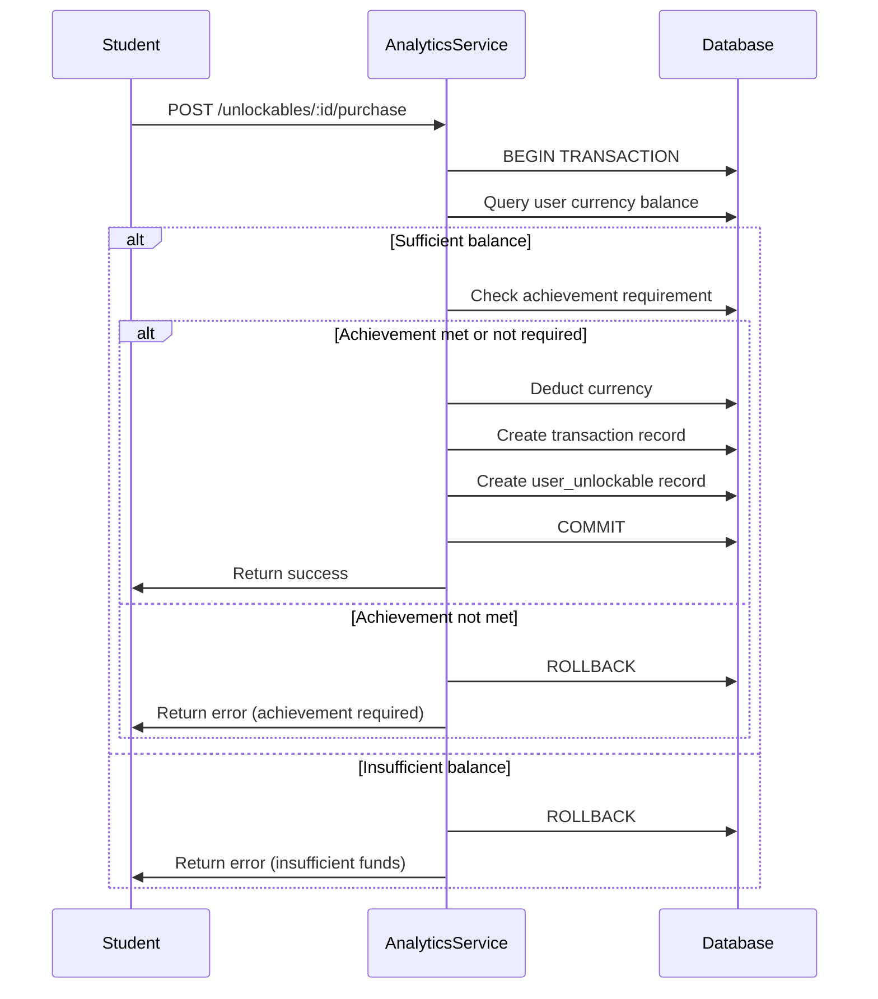

# Design Document: Enhanced Gamification

## Overview

The Enhanced Gamification feature expands Stunity Enterprise's existing gamification system to provide a comprehensive engagement platform that motivates students through diverse achievement categories, time-bound challenges, virtual currency economy, team-based collaboration, and deep academic integration. The system leverages the existing microservices architecture with analytics-service as the primary orchestrator, integrating with feed-service, auth-service, grade-service, and attendance-service.

### Design Goals

- Extend existing XP/badge/leaderboard system with minimal disruption to current functionality
- Scale to millions of concurrent users across mobile (React Native) and web (Next.js) platforms
- Provide real-time updates for competitive features using Supabase Realtime
- Maintain data consistency and integrity across distributed operations
- Enable rich personalization through achievement categories and challenge templates
- Foster both individual achievement and collaborative team dynamics
- Integrate seamlessly with academic performance data for holistic student engagement

### Key Design Principles

1. **Extensibility**: New achievement categories, challenge types, and unlockables can be added without schema changes
2. **Performance**: Sub-100ms response times for 95% of requests through caching and indexing
3. **Consistency**: ACID transactions for currency operations, idempotent achievement unlocks
4. **Real-time**: Supabase Realtime for leaderboards, team challenges, and social notifications
5. **Platform Parity**: Identical functionality on mobile and web with platform-appropriate UX
6. **Privacy-First**: Granular visibility controls and GDPR-compliant data management

## Architecture

### High-Level System Architecture



### Service Responsibilities

**Analytics Service (Port 3014)** - Primary gamification orchestrator
- Achievement evaluation and unlocking
- Challenge generation, tracking, and completion
- Virtual currency transactions and balance management
- Unlockable catalog and purchase processing
- Leaderboard calculation and ranking
- Team challenge coordination
- XP calculation and level progression
- Real-time event publishing

**Grade Service (Port 3007)** - Academic data provider
- Webhook to analytics-service on grade entry
- GPA and subject average calculations
- Grade trend analysis for achievement criteria

**Attendance Service (Port 3008)** - Attendance data provider
- Webhook to analytics-service on attendance record
- Streak calculation and validation
- Excused absence handling for grace periods

**Feed Service (Port 3010)** - Social integration
- Achievement announcement posts
- Social engagement metrics (likes, comments, shares)
- Congratulation reactions on achievement posts

**Auth Service (Port 3001)** - User management and notifications
- Push notification delivery
- User profile and privacy settings
- Deep link generation for notifications

### Data Flow Patterns

**Achievement Unlock Flow**
```
1. Trigger Event (grade entry, attendance, post creation)
2. Source Service → Analytics Service (webhook or direct call)
3. Analytics Service evaluates achievement criteria
4. If criteria met:
   a. Create achievement record (idempotent)
   b. Award XP and virtual currency
   c. Publish to Supabase Realtime
   d. Send notification via Auth Service
   e. Create feed post (if user settings allow)
5. Return achievement data to client
```

**Challenge Completion Flow**
```
1. User action triggers progress update
2. Analytics Service increments challenge progress
3. If challenge completed:
   a. Award virtual currency
   b. Update streak counters
   c. Check for streak bonuses
   d. Publish real-time update
   e. Send notification
4. Return updated challenge state
```

**Leaderboard Update Flow**
```
1. XP-affecting event occurs
2. Analytics Service updates user XP
3. Recalculate user rank (cached)
4. Publish rank change to Realtime channel
5. Clients subscribed to leaderboard receive update
6. UI updates within 2 seconds
```

## Components and Interfaces

### Database Schema Extensions

The following models extend the existing Prisma schema in `packages/database/prisma/schema.prisma`:

#### New Models

**GamificationAchievement** - Extends existing Achievement model
```prisma
model GamificationAchievement {
  id              String              @id @default(cuid())
  key             String              @unique
  category        AchievementCategory
  tier            AchievementTier     @default(BRONZE)
  name            String
  description     String
  iconUrl         String
  xpReward        Int
  currencyReward  Int                 @default(0)
  criteria        Json                // Flexible criteria definition
  isActive        Boolean             @default(true)
  createdAt       DateTime            @default(now())
  updatedAt       DateTime            @updatedAt
  
  userAchievements UserAchievementProgress[]
  
  @@index([category, tier])
  @@index([isActive])
  @@map("gamification_achievements")
}

enum AchievementCategory {
  ACADEMIC
  SOCIAL
  ATTENDANCE
  ENGAGEMENT
  SPECIAL_EVENT
}

enum AchievementTier {
  BRONZE
  SILVER
  GOLD
  PLATINUM
}
```

**UserAchievementProgress** - Tracks user progress toward achievements
```prisma
model UserAchievementProgress {
  id            String                  @id @default(cuid())
  userId        String
  achievementId String
  progress      Int                     @default(0)
  targetValue   Int
  isUnlocked    Boolean                 @default(false)
  unlockedAt    DateTime?
  createdAt     DateTime                @default(now())
  updatedAt     DateTime                @updatedAt
  
  user        User                    @relation(fields: [userId], references: [id], onDelete: Cascade)
  achievement GamificationAchievement @relation(fields: [achievementId], references: [id], onDelete: Cascade)
  
  @@unique([userId, achievementId])
  @@index([userId, isUnlocked])
  @@index([achievementId])
  @@map("user_achievement_progress")
}
```

**Challenge** - Daily, weekly, and special event challenges
```prisma
model Challenge {
  id              String          @id @default(cuid())
  userId          String
  templateId      String
  type            ChallengeType
  difficulty      ChallengeDifficulty
  title           String
  description     String
  targetValue     Int
  currentProgress Int             @default(0)
  currencyReward  Int
  xpReward        Int             @default(0)
  status          ChallengeStatus @default(ACTIVE)
  startDate       DateTime        @default(now())
  expiresAt       DateTime
  completedAt     DateTime?
  createdAt       DateTime        @default(now())
  updatedAt       DateTime        @updatedAt
  
  user     User              @relation(fields: [userId], references: [id], onDelete: Cascade)
  template ChallengeTemplate @relation(fields: [templateId], references: [id])
  
  @@index([userId, status, expiresAt])
  @@index([type, status])
  @@index([expiresAt])
  @@map("challenges")
}

enum ChallengeType {
  DAILY
  WEEKLY
  SPECIAL_EVENT
}

enum ChallengeDifficulty {
  EASY
  MEDIUM
  HARD
}

enum ChallengeStatus {
  ACTIVE
  COMPLETED
  EXPIRED
  ABANDONED
}
```

**ChallengeTemplate** - Reusable challenge definitions
```prisma
model ChallengeTemplate {
  id                String              @id @default(cuid())
  key               String              @unique
  type              ChallengeType
  difficulty        ChallengeDifficulty
  title             String
  description       String
  targetValueMin    Int
  targetValueMax    Int
  currencyRewardMin Int
  currencyRewardMax Int
  xpRewardMin       Int
  xpRewardMax       Int
  gradeLevel        String?             // null = all grades
  category          String              // academic, social, attendance, engagement
  isActive          Boolean             @default(true)
  isSeasonal        Boolean             @default(false)
  seasonalStart     DateTime?
  seasonalEnd       DateTime?
  createdAt         DateTime            @default(now())
  updatedAt         DateTime            @updatedAt
  
  challenges Challenge[]
  
  @@index([type, isActive])
  @@index([gradeLevel, isActive])
  @@index([isSeasonal, seasonalStart, seasonalEnd])
  @@map("challenge_templates")
}
```

**VirtualCurrency** - User currency balance and transaction log
```prisma
model VirtualCurrency {
  id           String   @id @default(cuid())
  userId       String   @unique
  balance      Int      @default(0)
  totalEarned  Int      @default(0)
  totalSpent   Int      @default(0)
  createdAt    DateTime @default(now())
  updatedAt    DateTime @updatedAt
  
  user         User                      @relation(fields: [userId], references: [id], onDelete: Cascade)
  transactions VirtualCurrencyTransaction[]
  
  @@index([userId])
  @@map("virtual_currency")
}

model VirtualCurrencyTransaction {
  id          String                    @id @default(cuid())
  userId      String
  currencyId  String
  amount      Int
  type        TransactionType
  source      String                    // challenge_completion, achievement_unlock, purchase, etc.
  sourceId    String?                   // ID of related entity
  balanceBefore Int
  balanceAfter  Int
  metadata    Json?
  createdAt   DateTime                  @default(now())
  
  user     User            @relation(fields: [userId], references: [id], onDelete: Cascade)
  currency VirtualCurrency @relation(fields: [currencyId], references: [id], onDelete: Cascade)
  
  @@index([userId, createdAt(sort: Desc)])
  @@index([type, createdAt])
  @@map("virtual_currency_transactions")
}

enum TransactionType {
  CREDIT
  DEBIT
}
```

**Unlockable** - Purchasable items (avatars, themes, badge frames)
```prisma
model Unlockable {
  id                  String           @id @default(cuid())
  key                 String           @unique
  name                String
  description         String
  type                UnlockableType
  cost                Int
  iconUrl             String
  previewUrl          String?
  requiredAchievement String?          // Achievement key required to unlock
  isActive            Boolean          @default(true)
  sortOrder           Int              @default(0)
  metadata            Json?            // Type-specific data (theme colors, avatar URL, etc.)
  createdAt           DateTime         @default(now())
  updatedAt           DateTime         @updatedAt
  
  userUnlockables UserUnlockable[]
  
  @@index([type, isActive])
  @@index([cost])
  @@map("unlockables")
}

enum UnlockableType {
  AVATAR
  THEME
  BADGE_FRAME
  PROFILE_EFFECT
}

model UserUnlockable {
  id           String      @id @default(cuid())
  userId       String
  unlockableId String
  purchasedAt  DateTime    @default(now())
  isEquipped   Boolean     @default(false)
  
  user       User       @relation(fields: [userId], references: [id], onDelete: Cascade)
  unlockable Unlockable @relation(fields: [unlockableId], references: [id], onDelete: Cascade)
  
  @@unique([userId, unlockableId])
  @@index([userId, isEquipped])
  @@map("user_unlockables")
}
```

**TeamChallenge** - Collaborative challenges
```prisma
model TeamChallenge {
  id          String                @id @default(cuid())
  name        String
  description String
  targetValue Int
  currentProgress Int               @default(0)
  status      TeamChallengeStatus   @default(ACTIVE)
  createdBy   String
  startDate   DateTime              @default(now())
  deadline    DateTime
  completedAt DateTime?
  createdAt   DateTime              @default(now())
  updatedAt   DateTime              @updatedAt
  
  creator      User                        @relation(fields: [createdBy], references: [id])
  participants TeamChallengeParticipant[]
  
  @@index([status, deadline])
  @@index([createdBy])
  @@map("team_challenges")
}

enum TeamChallengeStatus {
  ACTIVE
  COMPLETED
  EXPIRED
}

model TeamChallengeParticipant {
  id          String   @id @default(cuid())
  challengeId String
  userId      String
  contribution Int     @default(0)
  joinedAt    DateTime @default(now())
  
  challenge TeamChallenge @relation(fields: [challengeId], references: [id], onDelete: Cascade)
  user      User          @relation(fields: [userId], references: [id], onDelete: Cascade)
  
  @@unique([challengeId, userId])
  @@index([userId])
  @@index([challengeId, contribution(sort: Desc)])
  @@map("team_challenge_participants")
}
```

**Leaderboard** - Multi-category, multi-timeframe leaderboards
```prisma
model Leaderboard {
  id         String            @id @default(cuid())
  userId     String
  category   LeaderboardCategory
  scope      LeaderboardScope
  timePeriod LeaderboardPeriod
  value      Int
  rank       Int
  periodStart DateTime
  periodEnd   DateTime
  createdAt   DateTime         @default(now())
  updatedAt   DateTime         @updatedAt
  
  user User @relation(fields: [userId], references: [id], onDelete: Cascade)
  
  @@unique([userId, category, scope, timePeriod, periodStart])
  @@index([category, scope, timePeriod, periodStart, rank])
  @@index([userId, category])
  @@map("leaderboards")
}

enum LeaderboardCategory {
  TOTAL_XP
  ACADEMIC_PERFORMANCE
  SOCIAL_ENGAGEMENT
  ATTENDANCE_RATE
  CHALLENGE_COMPLETION
}

enum LeaderboardScope {
  SCHOOL_WIDE
  GRADE_LEVEL
  CLASS_SPECIFIC
}

enum LeaderboardPeriod {
  ALL_TIME
  MONTHLY
  WEEKLY
  DAILY
}
```

**AttendanceStreak** - Enhanced streak tracking
```prisma
model AttendanceStreak {
  id              String    @id @default(cuid())
  userId          String    @unique
  currentStreak   Int       @default(0)
  longestStreak   Int       @default(0)
  lastAttendance  DateTime?
  graceUsed       Boolean   @default(false)
  graceExpiresAt  DateTime?
  totalDays       Int       @default(0)
  createdAt       DateTime  @default(now())
  updatedAt       DateTime  @updatedAt
  
  user User @relation(fields: [userId], references: [id], onDelete: Cascade)
  
  @@index([userId])
  @@index([currentStreak(sort: Desc)])
  @@map("attendance_streaks")
}
```

**MilestoneEvent** - Track milestone celebrations
```prisma
model MilestoneEvent {
  id          String        @id @default(cuid())
  userId      String
  type        MilestoneType
  title       String
  description String
  metadata    Json?
  viewedAt    DateTime?
  createdAt   DateTime      @default(now())
  
  user User @relation(fields: [userId], references: [id], onDelete: Cascade)
  
  @@index([userId, viewedAt])
  @@index([createdAt(sort: Desc)])
  @@map("milestone_events")
}

enum MilestoneType {
  LEVEL_UP
  ACHIEVEMENT_UNLOCK
  STREAK_MILESTONE
  CHALLENGE_COMPLETION
  LEADERBOARD_TOP_10
}
```

#### Schema Modifications to Existing Models

**User Model Extensions**
```prisma
// Add to existing User model
model User {
  // ... existing fields ...
  
  // Gamification relations
  gamificationAchievements UserAchievementProgress[]
  challenges               Challenge[]
  virtualCurrency          VirtualCurrency?
  unlockables              UserUnlockable[]
  teamChallenges           TeamChallenge[]          @relation("TeamChallengeCreator")
  teamParticipations       TeamChallengeParticipant[]
  leaderboards             Leaderboard[]
  attendanceStreak         AttendanceStreak?
  milestones               MilestoneEvent[]
  
  // Gamification settings
  achievementSharingPreference String @default("MAJOR_ONLY") // ALL, MAJOR_ONLY, FRIENDS_ONLY, NONE
  notificationPreferences      Json?  // Per-event-type notification settings
}
```

### API Endpoints

All endpoints are prefixed with `/api/v1/gamification` and require JWT authentication.

#### Achievement Endpoints

**GET /achievements**
- Query params: `category`, `tier`, `unlocked`, `page`, `limit`
- Returns: Paginated list of achievements with user progress
- Response: `{ achievements: Achievement[], pagination: {...} }`

**GET /achievements/:id**
- Returns: Single achievement with detailed progress
- Response: `{ achievement: Achievement, progress: UserProgress }`

**GET /achievements/categories**
- Returns: Achievement counts by category
- Response: `{ categories: { ACADEMIC: 15, SOCIAL: 12, ... } }`

#### Challenge Endpoints

**GET /challenges**
- Query params: `type` (DAILY, WEEKLY, SPECIAL_EVENT), `status`, `page`, `limit`
- Returns: User's challenges with progress
- Response: `{ challenges: Challenge[], streaks: { daily: 5, weekly: 2 } }`

**POST /challenges/:id/progress**
- Body: `{ increment: number }`
- Returns: Updated challenge with completion status
- Response: `{ challenge: Challenge, completed: boolean, rewards: {...} }`

**GET /challenges/available**
- Returns: Available challenge templates for user
- Response: `{ templates: ChallengeTemplate[] }`

#### Virtual Currency Endpoints

**GET /currency**
- Returns: User's currency balance and recent transactions
- Response: `{ balance: 1250, totalEarned: 5000, totalSpent: 3750, recentTransactions: [...] }`

**GET /currency/transactions**
- Query params: `type`, `startDate`, `endDate`, `page`, `limit`
- Returns: Paginated transaction history
- Response: `{ transactions: Transaction[], pagination: {...} }`

**POST /currency/export**
- Body: `{ startDate, endDate }`
- Returns: JSON export of currency transactions
- Response: `{ export: {...}, downloadUrl: string }`

#### Unlockable Endpoints

**GET /unlockables**
- Query params: `type`, `owned`, `available`, `page`, `limit`
- Returns: Catalog of unlockables with ownership status
- Response: `{ unlockables: Unlockable[], userBalance: 1250 }`

**POST /unlockables/:id/purchase**
- Returns: Purchase confirmation and updated balance
- Response: `{ unlockable: Unlockable, newBalance: 750, transaction: {...} }`

**POST /unlockables/:id/equip**
- Returns: Updated equipped status
- Response: `{ unlockable: Unlockable, isEquipped: true }`

#### Leaderboard Endpoints

**GET /leaderboards/:category**
- Query params: `scope`, `timePeriod`, `page`, `limit`
- Returns: Ranked list with user's position
- Response: `{ entries: LeaderboardEntry[], userRank: 42, userEntry: {...} }`

**GET /leaderboards/user/:userId**
- Query params: `category`
- Returns: User's ranks across all categories
- Response: `{ ranks: { TOTAL_XP: 42, ACADEMIC: 15, ... } }`

**GET /leaderboards/archived**
- Query params: `category`, `timePeriod`, `periodStart`
- Returns: Historical leaderboard data
- Response: `{ entries: LeaderboardEntry[], period: {...} }`

#### Team Challenge Endpoints

**POST /team-challenges**
- Body: `{ name, description, targetValue, deadline, participantIds }`
- Returns: Created team challenge
- Response: `{ teamChallenge: TeamChallenge }`

**GET /team-challenges/:id**
- Returns: Team challenge with participant contributions
- Response: `{ teamChallenge: TeamChallenge, participants: [...], progress: 65 }`

**POST /team-challenges/:id/contribute**
- Body: `{ amount: number }`
- Returns: Updated team progress
- Response: `{ teamChallenge: TeamChallenge, userContribution: 150, totalProgress: 850 }`

**GET /team-challenges**
- Query params: `status`, `participating`, `page`, `limit`
- Returns: User's team challenges
- Response: `{ teamChallenges: TeamChallenge[] }`

#### Dashboard Endpoints

**GET /dashboard**
- Returns: Comprehensive dashboard data
- Response: `{ xp, level, achievements, challenges, currency, streaks, leaderboardRanks, recentActivity }`

**GET /dashboard/progress**
- Query params: `timePeriod` (WEEK, MONTH, QUARTER, YEAR, ALL_TIME)
- Returns: Progress charts data
- Response: `{ xpOverTime: [...], achievementRate: [...], streakHistory: [...], challengeSuccessRate: [...] }`

**POST /dashboard/export**
- Body: `{ startDate, endDate, includeAchievements, includeChallenges, includeTransactions }`
- Returns: Complete gamification data export
- Response: `{ export: {...}, downloadUrl: string, schemaVersion: "1.0" }`

#### Webhook Endpoints (Internal)

**POST /webhooks/grade-recorded**
- Body: `{ userId, subjectId, score, maxScore, percentage }`
- Evaluates grade-based achievements
- Returns: `{ achievementsUnlocked: [...], xpAwarded: number }`

**POST /webhooks/attendance-recorded**
- Body: `{ userId, date, status }`
- Updates attendance streaks and evaluates achievements
- Returns: `{ streakUpdated: boolean, achievementsUnlocked: [...] }`

**POST /webhooks/post-created**
- Body: `{ userId, postId, postType }`
- Updates social engagement metrics
- Returns: `{ metricsUpdated: boolean }`

**POST /webhooks/post-reaction**
- Body: `{ postId, userId, reactionType, count }`
- Evaluates viral post achievements
- Returns: `{ achievementsUnlocked: [...] }`

### Real-Time Subscription Channels

Using Supabase Realtime for live updates:

**Channel: `leaderboard:{category}:{scope}:{timePeriod}`**
- Events: `rank_change`, `new_leader`
- Payload: `{ userId, oldRank, newRank, value }`

**Channel: `team_challenge:{challengeId}`**
- Events: `progress_update`, `challenge_completed`, `member_joined`
- Payload: `{ userId, contribution, totalProgress, percentage }`

**Channel: `user:{userId}:achievements`**
- Events: `achievement_unlocked`, `milestone_reached`
- Payload: `{ achievement, rewards, celebrationData }`

**Channel: `user:{userId}:challenges`**
- Events: `challenge_completed`, `challenge_expiring`, `new_challenge`
- Payload: `{ challenge, rewards }`

## Data Models

### Achievement Criteria Structure

Achievement criteria stored as JSON in `GamificationAchievement.criteria`:

```typescript
interface AchievementCriteria {
  type: 'grade' | 'attendance' | 'social' | 'challenge' | 'composite';
  conditions: Condition[];
  operator: 'AND' | 'OR';
}

interface Condition {
  metric: string;  // e.g., 'grade_average', 'attendance_streak', 'posts_count'
  operator: 'gte' | 'lte' | 'eq' | 'gt' | 'lt';
  value: number;
  scope?: string;  // e.g., 'subject:math', 'timeframe:30days'
}

// Example: Honor Roll Achievement
{
  type: 'grade',
  conditions: [
    { metric: 'overall_average', operator: 'gte', value: 90 },
    { metric: 'graded_subjects', operator: 'gte', value: 5 }
  ],
  operator: 'AND'
}

// Example: Social Butterfly Achievement
{
  type: 'social',
  conditions: [
    { metric: 'posts_count', operator: 'gte', value: 50, scope: 'timeframe:30days' },
    { metric: 'likes_received', operator: 'gte', value: 200, scope: 'timeframe:30days' }
  ],
  operator: 'AND'
}
```

### Challenge Template Configuration

Challenge templates define parameterized challenges:

```typescript
interface ChallengeTemplateConfig {
  key: string;
  type: 'DAILY' | 'WEEKLY' | 'SPECIAL_EVENT';
  difficulty: 'EASY' | 'MEDIUM' | 'HARD';
  title: string;
  description: string;
  targetValueRange: [number, number];
  rewardRange: [number, number];
  gradeLevel?: string;
  category: string;
  evaluationLogic: string;  // Function name in challenge evaluator
}

// Example: Daily Post Challenge
{
  key: 'daily_post_3',
  type: 'DAILY',
  difficulty: 'EASY',
  title: 'Share Your Knowledge',
  description: 'Create 3 posts today',
  targetValueRange: [3, 3],
  rewardRange: [50, 50],
  category: 'social',
  evaluationLogic: 'countPostsToday'
}

// Example: Weekly Grade Improvement
{
  key: 'weekly_grade_improvement',
  type: 'WEEKLY',
  difficulty: 'MEDIUM',
  title: 'Academic Progress',
  description: 'Improve your average by 5% this week',
  targetValueRange: [5, 10],
  rewardRange: [200, 300],
  category: 'academic',
  evaluationLogic: 'calculateGradeImprovement'
}
```

### Unlockable Metadata Structure

Type-specific metadata for unlockables:

```typescript
// Avatar Unlockable
interface AvatarMetadata {
  imageUrl: string;
  thumbnailUrl: string;
  category: 'animal' | 'character' | 'abstract' | 'custom';
}

// Theme Unlockable
interface ThemeMetadata {
  primaryColor: string;
  secondaryColor: string;
  accentColor: string;
  backgroundImage?: string;
  previewImages: string[];
}

// Badge Frame Unlockable
interface BadgeFrameMetadata {
  frameImageUrl: string;
  animationType?: 'glow' | 'pulse' | 'sparkle' | 'none';
  rarity: 'common' | 'rare' | 'epic' | 'legendary';
}

// Profile Effect Unlockable
interface ProfileEffectMetadata {
  effectType: 'particles' | 'border' | 'background' | 'animation';
  effectConfig: Record<string, any>;
  duration?: number;  // For temporary effects
}
```

## Component Hierarchy

### Mobile (React Native) Components

```
GamificationNavigator
├── DashboardScreen
│   ├── XPProgressCard
│   ├── LevelIndicator
│   ├── QuickStatsGrid
│   ├── ActiveChallengesCarousel
│   └── RecentAchievementsRow
├── AchievementsScreen
│   ├── CategoryTabs
│   ├── AchievementGrid
│   │   └── AchievementCard
│   │       ├── AchievementIcon
│   │       ├── ProgressBar
│   │       └── TierBadge
│   └── AchievementDetailModal
├── ChallengesScreen
│   ├── ChallengeTypeTabs (Daily/Weekly/Special)
│   ├── ChallengeList
│   │   └── ChallengeCard
│   │       ├── ChallengeProgress
│   │       ├── RewardDisplay
│   │       └── ExpiryTimer
│   └── StreakIndicator
├── ShopScreen
│   ├── CurrencyBalance
│   ├── UnlockableCategories
│   └── UnlockableGrid
│       └── UnlockableCard
│           ├── PreviewImage
│           ├── PriceTag
│           └── PurchaseButton
├── LeaderboardScreen
│   ├── CategorySelector
│   ├── ScopeSelector
│   ├── TimePeriodSelector
│   ├── LeaderboardList
│   │   └── LeaderboardEntry
│   │       ├── RankBadge
│   │       ├── UserAvatar
│   │       └── ScoreDisplay
│   └── UserPositionCard
└── TeamChallengesScreen
    ├── ActiveTeamChallenges
    │   └── TeamChallengeCard
    │       ├── ProgressBar
    │       ├── ParticipantAvatars
    │       └── ContributionBreakdown
    └── CreateTeamChallengeModal
```

### Web (Next.js) Components

```
/gamification
├── /dashboard
│   ├── page.tsx (Dashboard)
│   ├── XPChart.tsx
│   ├── AchievementSummary.tsx
│   ├── ChallengeSummary.tsx
│   └── LeaderboardWidget.tsx
├── /achievements
│   ├── page.tsx (AchievementGallery)
│   ├── CategoryFilter.tsx
│   ├── AchievementGrid.tsx
│   └── [id]/page.tsx (AchievementDetail)
├── /challenges
│   ├── page.tsx (ChallengesDashboard)
│   ├── DailyChallenges.tsx
│   ├── WeeklyChallenges.tsx
│   └── SpecialEvents.tsx
├── /shop
│   ├── page.tsx (UnlockablesStore)
│   ├── CurrencyDisplay.tsx
│   ├── UnlockableFilters.tsx
│   └── UnlockableCard.tsx
├── /leaderboards
│   ├── page.tsx (LeaderboardsHub)
│   ├── LeaderboardTable.tsx
│   ├── LeaderboardFilters.tsx
│   └── [category]/page.tsx
└── /team-challenges
    ├── page.tsx (TeamChallengesPage)
    ├── TeamChallengeList.tsx
    ├── CreateTeamChallengeForm.tsx
    └── [id]/page.tsx (TeamChallengeDetail)
```

### Shared Components

```
components/gamification/
├── MilestoneCelebration.tsx (Lottie animation overlay)
├── CurrencyIcon.tsx
├── XPBadge.tsx
├── ProgressBar.tsx
├── TierBadge.tsx
├── StreakFlame.tsx
├── NotificationBadge.tsx
└── EmptyState.tsx
```

## State Management

### Mobile State Management (Zustand)

**gamificationStore.ts**
```typescript
interface GamificationState {
  // User stats
  xp: number;
  level: number;
  currency: number;
  
  // Achievements
  achievements: Achievement[];
  achievementProgress: Map<string, number>;
  unlockedAchievements: Set<string>;
  
  // Actions
  updateXP: (amount: number) => void;
  unlockAchievement: (achievementId: string) => void;
  updateAchievementProgress: (achievementId: string, progress: number) => void;
  
  // Sync
  syncFromServer: () => Promise<void>;
}
```

**challengeStore.ts**
```typescript
interface ChallengeState {
  // Challenges
  dailyChallenges: Challenge[];
  weeklyChallenges: Challenge[];
  specialChallenges: Challenge[];
  
  // Streaks
  dailyStreak: number;
  weeklyStreak: number;
  
  // Actions
  updateChallengeProgress: (challengeId: string, increment: number) => Promise<void>;
  completeChallenge: (challengeId: string) => Promise<void>;
  refreshChallenges: () => Promise<void>;
}
```

**leaderboardStore.ts**
```typescript
interface LeaderboardState {
  // Current leaderboard
  category: LeaderboardCategory;
  scope: LeaderboardScope;
  timePeriod: LeaderboardPeriod;
  entries: LeaderboardEntry[];
  userRank: number | null;
  
  // Actions
  fetchLeaderboard: (category, scope, timePeriod) => Promise<void>;
  subscribeToUpdates: () => void;
  unsubscribeFromUpdates: () => void;
}
```

### Web State Management (SWR + Context)

**useGamificationData.ts**
```typescript
export function useGamificationData() {
  const { data, error, mutate } = useSWR('/api/v1/gamification/dashboard', fetcher, {
    refreshInterval: 30000,  // 30 seconds
    revalidateOnFocus: true
  });
  
  return {
    dashboard: data,
    isLoading: !error && !data,
    isError: error,
    refresh: mutate
  };
}
```

**useAchievements.ts**
```typescript
export function useAchievements(category?: string, tier?: string) {
  const params = new URLSearchParams();
  if (category) params.append('category', category);
  if (tier) params.append('tier', tier);
  
  const { data, error } = useSWR(
    `/api/v1/gamification/achievements?${params}`,
    fetcher
  );
  
  return {
    achievements: data?.achievements || [],
    isLoading: !error && !data,
    isError: error
  };
}
```

**useLeaderboard.ts**
```typescript
export function useLeaderboard(category: string, scope: string, timePeriod: string) {
  const { data, error } = useSWR(
    `/api/v1/gamification/leaderboards/${category}?scope=${scope}&timePeriod=${timePeriod}`,
    fetcher,
    { refreshInterval: 60000 }  // 1 minute
  );
  
  // Subscribe to real-time updates
  useEffect(() => {
    const channel = supabase.channel(`leaderboard:${category}:${scope}:${timePeriod}`);
    channel.on('rank_change', (payload) => {
      mutate();  // Revalidate on rank change
    });
    channel.subscribe();
    
    return () => {
      channel.unsubscribe();
    };
  }, [category, scope, timePeriod]);
  
  return {
    entries: data?.entries || [],
    userRank: data?.userRank,
    isLoading: !error && !data,
    isError: error
  };
}
```

## Background Jobs

### Job Scheduling (Cloud Scheduler + Cloud Tasks)

**Daily Challenge Generation**
- Schedule: Every day at 00:00 UTC
- Function: `generateDailyChallenges()`
- Process:
  1. Query all active users
  2. Batch process in groups of 1000
  3. For each user:
     - Get grade level and activity history
     - Select 3 challenge templates (weighted by past completion)
     - Create Challenge records with 24-hour expiry
     - Publish notification event
  4. Log generation metrics

**Weekly Challenge Generation**
- Schedule: Every Monday at 00:00 UTC
- Function: `generateWeeklyChallenges()`
- Process:
  1. Query all active users
  2. Batch process in groups of 1000
  3. For each user:
     - Analyze previous week's activity
     - Select 5 challenge templates (varied difficulty)
     - Create Challenge records with 7-day expiry
     - Publish notification event
  4. Archive completed weekly challenges

**Challenge Expiry Cleanup**
- Schedule: Every hour
- Function: `expireChallenges()`
- Process:
  1. Query challenges where `expiresAt < now()` and `status = ACTIVE`
  2. Update status to EXPIRED
  3. Log expiry metrics
  4. Send "missed challenge" notifications (if enabled)

**Leaderboard Reset and Archival**
- Schedule: 
  - Daily: 00:00 UTC
  - Weekly: Monday 00:00 UTC
  - Monthly: 1st of month 00:00 UTC
- Function: `resetLeaderboards(period: LeaderboardPeriod)`
- Process:
  1. Query current leaderboard entries for period
  2. Archive to historical table
  3. Calculate final ranks and rewards
  4. Award top performers (top 10 get bonus currency)
  5. Reset period-specific counters
  6. Publish leaderboard reset event
  7. Send notifications to top performers

**Streak Validation**
- Schedule: Every day at 01:00 UTC (after attendance records finalized)
- Function: `validateStreaks()`
- Process:
  1. Query all active attendance streaks
  2. For each streak:
     - Check if attendance recorded for previous day
     - If yes: increment streak, check for milestones
     - If no and grace available: activate grace period
     - If no and grace expired: reset streak, save as previous best
  3. Publish streak update events
  4. Award milestone bonuses

**Achievement Evaluation Batch**
- Schedule: Every 6 hours
- Function: `evaluateAchievements()`
- Process:
  1. Query users with pending achievement evaluations
  2. For each user:
     - Fetch relevant metrics (grades, attendance, social)
     - Evaluate all achievement criteria
     - Unlock achievements if criteria met
     - Award rewards
  3. Publish achievement unlock events
  4. Create feed posts for major achievements

**Team Challenge Progress Sync**
- Schedule: Every 15 minutes
- Function: `syncTeamChallenges()`
- Process:
  1. Query active team challenges
  2. For each challenge:
     - Sum participant contributions
     - Update total progress
     - Check if target reached
     - If completed: award proportional rewards, publish event
  3. Publish progress updates to real-time channels

**Notification Batching**
- Schedule: Every 5 minutes
- Function: `batchNotifications()`
- Process:
  1. Query pending notifications from last 5 minutes
  2. Group by user and event type
  3. Batch similar notifications (e.g., "3 new achievements unlocked")
  4. Send to Auth Service for delivery
  5. Mark notifications as sent

## Integration Flows

### Grade-Based Achievement Flow



### Attendance Streak Flow



### Challenge Completion Flow



### Team Challenge Flow



### Unlockable Purchase Flow



## Performance Considerations

### Database Indexing Strategy

Critical indexes for query performance:

```sql
-- Achievement queries
CREATE INDEX idx_user_achievement_progress_user_unlocked 
  ON user_achievement_progress(user_id, is_unlocked);
CREATE INDEX idx_gamification_achievement_category_tier 
  ON gamification_achievements(category, tier);

-- Challenge queries
CREATE INDEX idx_challenges_user_status_expires 
  ON challenges(user_id, status, expires_at);
CREATE INDEX idx_challenges_type_status 
  ON challenges(type, status);

-- Leaderboard queries
CREATE INDEX idx_leaderboard_category_scope_period_rank 
  ON leaderboards(category, scope, time_period, period_start, rank);
CREATE INDEX idx_leaderboard_user_category 
  ON leaderboards(user_id, category);

-- Currency queries
CREATE INDEX idx_virtual_currency_transactions_user_created 
  ON virtual_currency_transactions(user_id, created_at DESC);

-- Team challenge queries
CREATE INDEX idx_team_challenge_participants_challenge_contribution 
  ON team_challenge_participants(challenge_id, contribution DESC);
```

### Caching Strategy

**Redis Cache Keys and TTLs:**

```typescript
// Leaderboard caching (60 second TTL)
const leaderboardKey = `leaderboard:${category}:${scope}:${timePeriod}:${periodStart}`;
await redis.setex(leaderboardKey, 60, JSON.stringify(leaderboardData));

// User dashboard caching (30 second TTL)
const dashboardKey = `dashboard:${userId}`;
await redis.setex(dashboardKey, 30, JSON.stringify(dashboardData));

// Achievement catalog caching (5 minute TTL)
const achievementCatalogKey = `achievements:catalog:${category}`;
await redis.setex(achievementCatalogKey, 300, JSON.stringify(achievements));

// Challenge templates caching (1 hour TTL)
const templatesKey = `challenge_templates:${type}:${gradeLevel}`;
await redis.setex(templatesKey, 3600, JSON.stringify(templates));

// User currency balance caching (10 second TTL)
const currencyKey = `currency:${userId}`;
await redis.setex(currencyKey, 10, balance.toString());
```

**Cache Invalidation:**
- Leaderboard: Invalidate on XP change, reset on period end
- Dashboard: Invalidate on any gamification event
- Currency: Invalidate on transaction
- Achievements: Invalidate on unlock
- Templates: Invalidate on admin update

### Query Optimization

**Batch Operations:**
```typescript
// Batch achievement evaluation
async function evaluateAchievementsBatch(userIds: string[]) {
  const users = await prisma.user.findMany({
    where: { id: { in: userIds } },
    include: {
      grades: { where: { year: currentYear } },
      attendance: { where: { date: { gte: thirtyDaysAgo } } },
      posts: { where: { createdAt: { gte: thirtyDaysAgo } } }
    }
  });
  
  // Process in parallel
  await Promise.all(users.map(user => evaluateAchievements(user)));
}
```

**Pagination:**
```typescript
// Cursor-based pagination for large result sets
async function getLeaderboard(category, scope, timePeriod, cursor?, limit = 50) {
  const entries = await prisma.leaderboard.findMany({
    where: { category, scope, timePeriod },
    orderBy: { rank: 'asc' },
    take: limit + 1,
    cursor: cursor ? { id: cursor } : undefined
  });
  
  const hasMore = entries.length > limit;
  const results = hasMore ? entries.slice(0, -1) : entries;
  const nextCursor = hasMore ? results[results.length - 1].id : null;
  
  return { entries: results, nextCursor, hasMore };
}
```

### Rate Limiting

```typescript
// Rate limit configuration (per user)
const rateLimits = {
  'POST /challenges/:id/progress': { requests: 100, window: 60 },  // 100/min
  'POST /unlockables/:id/purchase': { requests: 10, window: 60 },  // 10/min
  'GET /leaderboards/:category': { requests: 60, window: 60 },     // 60/min
  'POST /team-challenges/:id/contribute': { requests: 50, window: 60 }  // 50/min
};

// Implementation using Redis
async function checkRateLimit(userId: string, endpoint: string) {
  const key = `ratelimit:${userId}:${endpoint}`;
  const limit = rateLimits[endpoint];
  
  const current = await redis.incr(key);
  if (current === 1) {
    await redis.expire(key, limit.window);
  }
  
  if (current > limit.requests) {
    throw new RateLimitError(`Rate limit exceeded for ${endpoint}`);
  }
}
```

## Security Considerations

### Authentication and Authorization

All gamification endpoints require JWT authentication with the following checks:

```typescript
// Middleware for gamification endpoints
async function gamificationAuth(req, res, next) {
  const token = req.headers.authorization?.replace('Bearer ', '');
  if (!token) return res.status(401).json({ error: 'Unauthorized' });
  
  try {
    const decoded = jwt.verify(token, process.env.JWT_SECRET);
    req.userId = decoded.userId;
    req.userRole = decoded.role;
    
    // Check if user is active
    const user = await prisma.user.findUnique({
      where: { id: req.userId },
      select: { isActive: true, accountSuspendedAt: true }
    });
    
    if (!user?.isActive || user.accountSuspendedAt) {
      return res.status(403).json({ error: 'Account suspended' });
    }
    
    next();
  } catch (error) {
    return res.status(401).json({ error: 'Invalid token' });
  }
}
```

### Data Validation

**Input Validation:**
```typescript
// Challenge progress validation
const challengeProgressSchema = z.object({
  increment: z.number().int().positive().max(1000)
});

// Unlockable purchase validation
const purchaseSchema = z.object({
  unlockableId: z.string().cuid()
});

// Team challenge creation validation
const teamChallengeSchema = z.object({
  name: z.string().min(3).max(100),
  description: z.string().min(10).max(500),
  targetValue: z.number().int().positive().max(1000000),
  deadline: z.date().min(new Date()),
  participantIds: z.array(z.string().cuid()).min(2).max(50)
});
```

### Transaction Safety

**Currency Operations:**
```typescript
async function awardCurrency(userId: string, amount: number, source: string, sourceId?: string) {
  return await prisma.$transaction(async (tx) => {
    // Get current balance with row lock
    const currency = await tx.virtualCurrency.findUnique({
      where: { userId },
      select: { id: true, balance: true }
    });
    
    if (!currency) {
      throw new Error('Currency account not found');
    }
    
    const newBalance = currency.balance + amount;
    
    // Update balance
    await tx.virtualCurrency.update({
      where: { userId },
      data: {
        balance: newBalance,
        totalEarned: { increment: amount }
      }
    });
    
    // Create transaction record
    await tx.virtualCurrencyTransaction.create({
      data: {
        userId,
        currencyId: currency.id,
        amount,
        type: 'CREDIT',
        source,
        sourceId,
        balanceBefore: currency.balance,
        balanceAfter: newBalance
      }
    });
    
    return newBalance;
  });
}
```

**Achievement Unlock Idempotency:**
```typescript
async function unlockAchievement(userId: string, achievementId: string) {
  return await prisma.$transaction(async (tx) => {
    // Check if already unlocked (idempotent)
    const existing = await tx.userAchievementProgress.findUnique({
      where: {
        userId_achievementId: { userId, achievementId }
      }
    });
    
    if (existing?.isUnlocked) {
      return { alreadyUnlocked: true, achievement: existing };
    }
    
    // Get achievement details
    const achievement = await tx.gamificationAchievement.findUnique({
      where: { id: achievementId }
    });
    
    if (!achievement) {
      throw new Error('Achievement not found');
    }
    
    // Unlock achievement
    const unlocked = await tx.userAchievementProgress.upsert({
      where: {
        userId_achievementId: { userId, achievementId }
      },
      update: {
        isUnlocked: true,
        unlockedAt: new Date(),
        progress: achievement.criteria.targetValue
      },
      create: {
        userId,
        achievementId,
        isUnlocked: true,
        unlockedAt: new Date(),
        progress: achievement.criteria.targetValue,
        targetValue: achievement.criteria.targetValue
      }
    });
    
    // Award rewards
    await awardCurrency(userId, achievement.currencyReward, 'achievement_unlock', achievementId);
    await awardXP(userId, achievement.xpReward);
    
    return { alreadyUnlocked: false, achievement: unlocked };
  });
}
```

### Privacy Controls

**Leaderboard Visibility:**
```typescript
async function getLeaderboard(category, scope, timePeriod, requestingUserId) {
  const entries = await prisma.leaderboard.findMany({
    where: {
      category,
      scope,
      timePeriod,
      user: {
        // Respect privacy settings
        OR: [
          { profileVisibility: 'PUBLIC' },
          { profileVisibility: 'SCHOOL', schoolId: requestingUser.schoolId },
          { id: requestingUserId }  // Always show requesting user
        ]
      }
    },
    include: {
      user: {
        select: {
          id: true,
          firstName: true,
          lastName: true,
          profilePictureUrl: true,
          profileVisibility: true
        }
      }
    },
    orderBy: { rank: 'asc' }
  });
  
  return entries;
}
```

## Correctness Properties

A property is a characteristic or behavior that should hold true across all valid executions of a system—essentially, a formal statement about what the system should do. Properties serve as the bridge between human-readable specifications and machine-verifiable correctness guarantees.

### Acceptance Criteria Testing Prework

Before defining correctness properties, we analyze each acceptance criterion to determine if it's testable as a property, example, edge case, or not testable.

**Requirement 1: Achievement Category System**

1.1 THE Analytics_Service SHALL support achievement categories: Academic, Social, Attendance, Engagement, and Special_Event
  Thoughts: This is about the system supporting specific enum values. We can test that achievements can be created with each category and that filtering by category works correctly.
  Testable: yes - property

1.2 WHEN an achievement is created, THE Analytics_Service SHALL assign it to exactly one Achievement_Category
  Thoughts: This is a constraint that should hold for all achievements. We can generate random achievements and verify each has exactly one category.
  Testable: yes - property

1.3 THE Analytics_Service SHALL track user progress separately for each Achievement_Category
  Thoughts: This is about data isolation. We can test that progress in one category doesn't affect another.
  Testable: yes - property

1.4 WHEN a user views achievements, THE System SHALL display them grouped by Achievement_Category
  Thoughts: This is a UI rendering requirement. We can test that the grouping function correctly partitions achievements by category.
  Testable: yes - property

1.5 FOR ALL achievements in a category, the total count SHALL equal the sum of locked and unlocked achievements in that category (invariant property)
  Thoughts: This is explicitly stated as an invariant. We can test that locked + unlocked = total for any category.
  Testable: yes - property

1.6 WHEN achievements are filtered by category, THE System SHALL return only achievements matching the specified Achievement_Category
  Thoughts: This is a filtering correctness property. For any category filter, all results should match that category.
  Testable: yes - property

**Requirement 2: Progressive Achievement Tiers**

2.1 THE Analytics_Service SHALL support tiered achievements with Bronze, Silver, Gold, and Platinum levels
  Thoughts: Similar to 1.1, this is about supporting specific enum values.
  Testable: yes - property

2.2 WHEN a user unlocks an achievement tier, THE Analytics_Service SHALL check if the next tier criteria is met
  Thoughts: This is about automatic progression checking. We can test that unlocking a tier triggers evaluation of the next tier.
  Testable: yes - property

2.3 THE Analytics_Service SHALL enforce that higher tiers require strictly greater criteria values than lower tiers
  Thoughts: This is an ordering invariant. For any tiered achievement, Bronze < Silver < Gold < Platinum in terms of criteria.
  Testable: yes - property

2.4 WHEN displaying tiered achievements, THE System SHALL show current tier and progress toward next tier
  Thoughts: This is a UI rendering requirement. We can test that the display function includes both current tier and next tier progress.
  Testable: yes - property

2.5 FOR ALL tiered achievements, the tier order SHALL be Bronze < Silver < Gold < Platinum (invariant property)
  Thoughts: This is explicitly stated as an invariant and is the same as 2.3.
  Testable: yes - property (redundant with 2.3)

2.6 THE Analytics_Service SHALL award XP points scaled by achievement tier (Bronze: 1x, Silver: 2x, Gold: 3x, Platinum: 5x)
  Thoughts: This is a reward scaling property. For any achievement, the XP awarded should match the tier multiplier.
  Testable: yes - property

**Requirement 3: Daily Challenge System**

3.1 THE Analytics_Service SHALL generate three daily challenges per user at midnight UTC
  Thoughts: This is about the challenge generation job. We can test that the generation function creates exactly 3 challenges per user.
  Testable: yes - property

3.2 WHEN a daily challenge is generated, THE Analytics_Service SHALL select from a pool of challenge templates appropriate to the user's grade level
  Thoughts: This is about template selection logic. We can test that generated challenges match the user's grade level.
  Testable: yes - property

3.3 THE Analytics_Service SHALL expire uncompleted daily challenges after 24 hours
  Thoughts: This is a time-based expiry rule. We can test that challenges created at time T expire at T+24h.
  Testable: yes - property

3.4 WHEN a user completes a daily challenge, THE Analytics_Service SHALL award the specified Virtual_Currency amount
  Thoughts: This is a reward awarding property. For any challenge completion, the currency awarded should match the challenge's reward amount.
  Testable: yes - property

3.5 THE Analytics_Service SHALL track daily challenge completion streaks
  Thoughts: This is about streak calculation. We can test that consecutive daily completions increment the streak correctly.
  Testable: yes - property

3.6 WHEN a user completes all three daily challenges, THE Analytics_Service SHALL award a streak bonus of 50 Virtual_Currency
  Thoughts: This is a specific bonus rule. We can test that completing all 3 challenges awards the bonus.
  Testable: yes - property

3.7 FOR ALL active daily challenges, the expiration timestamp SHALL be greater than the current timestamp (invariant property)
  Thoughts: This is an invariant about active challenges. Any challenge with status ACTIVE should have expiresAt > now.
  Testable: yes - property

**Requirement 5: Virtual Currency System**

5.1 THE Analytics_Service SHALL maintain a Virtual_Currency balance for each user
  Thoughts: This is about data existence. We can test that every user has a currency record.
  Testable: yes - property

5.2 WHEN a user earns Virtual_Currency, THE Analytics_Service SHALL increment their balance by the earned amount
  Thoughts: This is a balance update property. For any credit transaction, new balance = old balance + amount.
  Testable: yes - property

5.3 WHEN a user spends Virtual_Currency, THE Analytics_Service SHALL decrement their balance by the spent amount only if balance is sufficient
  Thoughts: This is a conditional debit property. Spending should only succeed if balance >= amount.
  Testable: yes - property

5.4 THE Analytics_Service SHALL prevent Virtual_Currency balance from becoming negative
  Thoughts: This is a non-negativity invariant. For all users, balance >= 0.
  Testable: yes - property

5.5 THE Analytics_Service SHALL log all Virtual_Currency transactions with timestamp, amount, and transaction type
  Thoughts: This is about transaction logging completeness. Every transaction should have all required fields.
  Testable: yes - property

5.6 FOR ALL Virtual_Currency transactions, the sum of credits minus debits SHALL equal the current balance (invariant property)
  Thoughts: This is the fundamental currency invariant. Sum(credits) - Sum(debits) = balance.
  Testable: yes - property

5.7 WHEN Virtual_Currency is awarded, THE System SHALL display an animated notification showing the amount earned
  Thoughts: This is a UI notification requirement. Not easily testable in automated tests.
  Testable: no

**Requirement 6: Unlockable Items System**

6.1 THE Analytics_Service SHALL maintain a catalog of unlockable items including avatars, themes, badge frames, and profile effects
  Thoughts: This is about catalog existence and types. We can test that the catalog contains items of each type.
  Testable: yes - example

6.2 WHEN a user purchases an unlockable, THE Analytics_Service SHALL verify sufficient Virtual_Currency balance before completing the transaction
  Thoughts: This is a pre-condition check. Purchase should fail if balance < cost.
  Testable: yes - property

6.3 THE Analytics_Service SHALL mark purchased unlockables as owned by the user
  Thoughts: This is about ownership tracking. After purchase, the unlockable should appear in user's owned items.
  Testable: yes - property

6.4 THE Analytics_Service SHALL prevent duplicate purchases of the same unlockable
  Thoughts: This is an idempotency property. Purchasing the same item twice should fail or be a no-op.
  Testable: yes - property

6.5 WHEN a user views the unlockables catalog, THE System SHALL display owned items, available items, and locked items requiring achievements
  Thoughts: This is a UI categorization requirement. We can test that the categorization function correctly partitions items.
  Testable: yes - property

6.6 WHERE an unlockable requires an achievement, THE Analytics_Service SHALL only allow purchase after the achievement is unlocked
  Thoughts: This is a pre-condition check. Purchase should fail if required achievement is not unlocked.
  Testable: yes - property

6.7 FOR ALL users, the set of owned unlockables SHALL be a subset of all available unlockables (invariant property)
  Thoughts: This is a set containment invariant. owned ⊆ available.
  Testable: yes - property

**Requirement 7: Multi-Category Leaderboards**

7.1 THE Analytics_Service SHALL maintain separate leaderboards for: Total_XP, Academic_Performance, Social_Engagement, Attendance_Rate, and Challenge_Completion
  Thoughts: This is about supporting multiple leaderboard categories. We can test that each category exists and is independent.
  Testable: yes - property

7.2 WHEN leaderboard data is requested, THE Analytics_Service SHALL return rankings sorted in descending order by the specified metric
  Thoughts: This is a sorting property. For any leaderboard, entries should be ordered by value descending.
  Testable: yes - property

7.3 THE Analytics_Service SHALL support leaderboard scopes: School_Wide, Grade_Level, and Class_Specific
  Thoughts: This is about scope filtering. We can test that each scope returns only relevant users.
  Testable: yes - property

7.4 WHEN a user views a leaderboard, THE System SHALL highlight the user's current rank and position
  Thoughts: This is a UI highlighting requirement. We can test that the user's entry is included in the response.
  Testable: yes - property

7.5 THE Analytics_Service SHALL update leaderboard rankings in real-time using Supabase_Realtime subscriptions
  Thoughts: This is about real-time updates. Difficult to test in unit tests, more of an integration test.
  Testable: no

7.6 FOR ALL leaderboard entries, ranks SHALL be sequential integers starting from 1 with no gaps for tied scores (invariant property)
  Thoughts: This is a ranking invariant. Ranks should be 1, 2, 2, 4, 5... (no gaps except for ties).
  Testable: yes - property

7.7 THE Analytics_Service SHALL handle tied scores by assigning the same rank and skipping subsequent ranks appropriately
  Thoughts: This is the tie-handling rule. If two users tie for rank 2, the next rank should be 4.
  Testable: yes - property

**Requirement 9: Team Challenge System**

9.1 THE Analytics_Service SHALL allow creation of Team_Challenges with 2 to 50 participants
  Thoughts: This is a constraint on team size. We can test that creation fails outside this range.
  Testable: yes - property

9.2 WHEN a Team_Challenge is created, THE Analytics_Service SHALL assign a unique identifier and set a deadline
  Thoughts: This is about required fields. We can test that created challenges have id and deadline.
  Testable: yes - property

9.3 THE Analytics_Service SHALL track individual contributions to the Team_Challenge goal
  Thoughts: This is about contribution tracking. We can test that contributions are recorded per participant.
  Testable: yes - property

9.4 WHEN any team member makes progress, THE Analytics_Service SHALL update the team's total progress using Supabase_Realtime
  Thoughts: This is about real-time updates. The core logic (updating total) is testable, real-time delivery is not.
  Testable: yes - property (for the update logic)

9.5 WHEN a Team_Challenge is completed, THE Analytics_Service SHALL award Virtual_Currency to all participants proportional to their contribution
  Thoughts: This is a proportional reward property. Each participant's reward should be proportional to their contribution percentage.
  Testable: yes - property

9.6 THE Analytics_Service SHALL allow team members to view a contribution breakdown showing each member's percentage
  Thoughts: This is about calculation correctness. Sum of percentages should equal 100%.
  Testable: yes - property

9.7 FOR ALL Team_Challenges, the sum of individual contributions SHALL equal the total team progress (invariant property)
  Thoughts: This is explicitly stated as an invariant. Sum(contributions) = totalProgress.
  Testable: yes - property

**Requirement 11: Attendance Integration - Streak Enhancements**

11.1 WHEN Attendance_Service records attendance, THE Analytics_Service SHALL update the user's attendance streak
  Thoughts: This is about streak calculation. We can test that attendance records correctly update streaks.
  Testable: yes - property

11.2 THE Analytics_Service SHALL award milestone bonuses at streak days: 7, 30, 60, 90, 180, 365
  Thoughts: This is about milestone detection. We can test that reaching these specific days triggers bonuses.
  Testable: yes - property

11.3 THE Analytics_Service SHALL increase Virtual_Currency rewards exponentially with streak length (base: 10 coins per day, multiplier: 1.1^(streak/7))
  Thoughts: This is a reward calculation formula. We can test that the formula is applied correctly.
  Testable: yes - property

11.4 WHEN a streak is broken, THE Analytics_Service SHALL store the previous streak as a personal record
  Thoughts: This is about data preservation. We can test that longestStreak is updated when current streak is broken.
  Testable: yes - property

11.5 THE Analytics_Service SHALL display a streak recovery grace period of 1 day for excused absences
  Thoughts: This is about grace period logic. We can test that one excused absence doesn't break the streak.
  Testable: yes - property

11.6 WHEN a user reaches a 30-day streak, THE Analytics_Service SHALL unlock a special Attendance_Champion badge
  Thoughts: This is a specific achievement trigger. We can test that 30-day streak unlocks this badge.
  Testable: yes - example

11.7 FOR ALL active streaks, the streak count SHALL equal the number of consecutive attendance days (invariant property)
  Thoughts: This is a streak calculation invariant. We can test that the count matches consecutive days.
  Testable: yes - property

**Requirement 20: Data Export and Analytics**

20.7 FOR ALL exported data, parsing the JSON then serializing it SHALL produce valid JSON matching the schema (round-trip property)
  Thoughts: This is explicitly a round-trip property. parse(export) then serialize should match original.
  Testable: yes - property

**Requirement 22: Data Consistency and Integrity**

22.5 THE Analytics_Service SHALL implement idempotent achievement unlock operations (unlocking twice has same effect as unlocking once)
  Thoughts: This is an idempotency property. unlock(unlock(x)) = unlock(x).
  Testable: yes - property

22.7 FOR ALL Virtual_Currency transactions, the database SHALL enforce a check constraint preventing negative balances (invariant property)
  Thoughts: This is a database constraint. We can test that attempts to create negative balances fail.
  Testable: yes - property

### Property Reflection

After analyzing all acceptance criteria, we identify redundancies and consolidate properties:

**Redundancies Identified:**
- Property 2.3 and 2.5 both test tier ordering (consolidate into one)
- Property 5.4 and 22.7 both test non-negative balance (consolidate into one)
- Property 7.6 and 7.7 both test ranking with ties (consolidate into one comprehensive property)
- Multiple properties test filtering correctness (1.6, 7.3) - can be generalized

**Consolidated Properties:**
After removing redundancies, we have the following unique, high-value properties to implement:

1. Virtual Currency Balance Invariant (from Req 5.6, 5.4, 22.7)
2. Achievement Unlock Idempotence (from Req 22.5)
3. Leaderboard Ranking Consistency with Ties (from Req 7.6, 7.7)
4. Challenge Progress Monotonicity (from Req 3.5, 4.5)
5. Team Challenge Contribution Sum (from Req 9.7)
6. Streak Calculation Correctness (from Req 11.7)
7. Achievement Tier Ordering (from Req 2.3, 2.5)
8. Time Period Leaderboard Boundaries (from Req 8.7)
9. Export-Import Round Trip (from Req 20.7)
10. Reward Scaling Consistency (from Req 2.6)
11. Challenge Expiry Timing (from Req 3.3, 3.7)
12. Unlockable Purchase Validation (from Req 6.2, 6.6)
13. Achievement Category Partitioning (from Req 1.5)
14. Team Size Constraints (from Req 9.1)
15. Proportional Reward Distribution (from Req 9.5)

### Correctness Properties

### Property 1: Virtual Currency Balance Invariant

For any user at any point in time, the virtual currency balance SHALL equal the sum of all credit transactions minus the sum of all debit transactions, and the balance SHALL never be negative.

**Validates: Requirements 5.2, 5.3, 5.4, 5.6, 22.7**

### Property 2: Achievement Unlock Idempotence

For any achievement and any user, unlocking the same achievement multiple times SHALL result in the same state as unlocking it once (the achievement is marked as unlocked exactly once, and rewards are awarded exactly once).

**Validates: Requirements 22.5**

### Property 3: Leaderboard Ranking Consistency with Ties

For any leaderboard, if user A has a higher score than user B, then user A's rank SHALL be less than user B's rank. When users have equal scores, they SHALL have equal ranks, and the next rank SHALL skip appropriately (e.g., if two users tie for rank 2, the next rank is 4).

**Validates: Requirements 7.2, 7.6, 7.7**

### Property 4: Challenge Progress Monotonicity

For any challenge with progress tracking, the progress value SHALL never decrease unless the challenge is explicitly reset or expired. Each progress update SHALL either maintain or increase the current progress value.

**Validates: Requirements 3.5, 4.5**

### Property 5: Team Challenge Contribution Sum

For any team challenge at any point in time, the sum of all individual participant contributions SHALL equal the team's total progress value.

**Validates: Requirements 9.3, 9.4, 9.7**

### Property 6: Streak Calculation Correctness

For any attendance or activity streak, the current streak count SHALL equal the number of consecutive days with recorded activity, starting from the most recent day and counting backward until a gap is found (excluding grace periods for excused absences).

**Validates: Requirements 3.5, 11.1, 11.7**

### Property 7: Achievement Tier Ordering

For any tiered achievement, the criteria threshold for tier N+1 SHALL be strictly greater than the threshold for tier N, following the order: Bronze < Silver < Gold < Platinum.

**Validates: Requirements 2.3, 2.5**

### Property 8: Time Period Leaderboard Boundaries

For any time-period leaderboard (daily, weekly, monthly), every included data point's timestamp SHALL fall within the leaderboard's start and end timestamps (inclusive).

**Validates: Requirements 8.2, 8.3, 8.4, 8.5**

### Property 9: Export-Import Round Trip

For any gamification data export, parsing the exported JSON and then serializing it SHALL produce valid JSON that matches the original export schema structure and contains equivalent data.

**Validates: Requirements 20.7**

### Property 10: Reward Scaling Consistency

For any achievement with tier-based rewards, the reward amount SHALL increase monotonically with tier level according to the defined multipliers (Bronze: 1x, Silver: 2x, Gold: 3x, Platinum: 5x).

**Validates: Requirements 2.6**

### Property 11: Challenge Expiry Timing

For any daily challenge, the expiration timestamp SHALL be exactly 24 hours after the creation timestamp. For any weekly challenge, the expiration timestamp SHALL be exactly 7 days after the creation timestamp. For all active challenges, the expiration timestamp SHALL be greater than the current timestamp.

**Validates: Requirements 3.3, 3.7, 4.3**

### Property 12: Unlockable Purchase Validation

For any unlockable purchase attempt, the transaction SHALL only succeed if: (1) the user's virtual currency balance is greater than or equal to the item cost, and (2) if the unlockable requires an achievement, that achievement is unlocked by the user. After a successful purchase, the user's balance SHALL equal the previous balance minus the item cost.

**Validates: Requirements 6.2, 6.3, 6.6**

### Property 13: Achievement Category Partitioning

For any achievement category, the total count of achievements in that category SHALL equal the sum of locked achievements and unlocked achievements for any user. No achievement SHALL belong to more than one category.

**Validates: Requirements 1.2, 1.5**

### Property 14: Team Size Constraints

For any team challenge, the number of participants SHALL be at least 2 and at most 50. Team challenge creation SHALL fail if the participant count is outside this range.

**Validates: Requirements 9.1**

### Property 15: Proportional Reward Distribution

For any completed team challenge, each participant's reward SHALL be proportional to their contribution percentage. The sum of all participant contribution percentages SHALL equal 100%, and each participant's reward SHALL equal (totalReward × contributionPercentage / 100).

**Validates: Requirements 9.5, 9.6**

## Error Handling

### Error Response Format

All API errors follow a consistent format:

```typescript
interface ErrorResponse {
  error: {
    code: string;
    message: string;
    details?: Record<string, any>;
    timestamp: string;
  };
}
```

### Error Codes and Handling

**Authentication Errors (401)**
- `AUTH_TOKEN_MISSING`: No authorization token provided
- `AUTH_TOKEN_INVALID`: Token is malformed or expired
- `AUTH_TOKEN_REVOKED`: Token has been revoked

**Authorization Errors (403)**
- `ACCOUNT_SUSPENDED`: User account is suspended
- `ACCOUNT_INACTIVE`: User account is not active
- `INSUFFICIENT_PERMISSIONS`: User lacks required permissions

**Validation Errors (400)**
- `INVALID_INPUT`: Request body validation failed
- `INVALID_CHALLENGE_PROGRESS`: Progress increment is invalid
- `INVALID_TEAM_SIZE`: Team size outside allowed range (2-50)
- `INVALID_DATE_RANGE`: Date range is invalid or in the past

**Business Logic Errors (422)**
- `INSUFFICIENT_BALANCE`: Not enough virtual currency for purchase
- `ACHIEVEMENT_REQUIRED`: Unlockable requires an achievement not yet unlocked
- `ALREADY_OWNED`: User already owns this unlockable
- `CHALLENGE_EXPIRED`: Challenge has expired and cannot be completed
- `CHALLENGE_ALREADY_COMPLETED`: Challenge is already marked as completed
- `TEAM_CHALLENGE_FULL`: Team challenge has reached maximum participants

**Not Found Errors (404)**
- `ACHIEVEMENT_NOT_FOUND`: Achievement ID does not exist
- `CHALLENGE_NOT_FOUND`: Challenge ID does not exist
- `UNLOCKABLE_NOT_FOUND`: Unlockable ID does not exist
- `TEAM_CHALLENGE_NOT_FOUND`: Team challenge ID does not exist
- `USER_NOT_FOUND`: User ID does not exist

**Rate Limit Errors (429)**
- `RATE_LIMIT_EXCEEDED`: Too many requests in time window

**Server Errors (500)**
- `INTERNAL_ERROR`: Unexpected server error
- `DATABASE_ERROR`: Database operation failed
- `TRANSACTION_FAILED`: Database transaction failed and was rolled back

### Error Recovery Strategies

**Transaction Failures:**
```typescript
async function purchaseUnlockable(userId: string, unlockableId: string) {
  const maxRetries = 3;
  let attempt = 0;
  
  while (attempt < maxRetries) {
    try {
      return await prisma.$transaction(async (tx) => {
        // Purchase logic
      });
    } catch (error) {
      attempt++;
      
      if (error.code === 'P2034') {  // Prisma transaction conflict
        if (attempt < maxRetries) {
          await sleep(100 * attempt);  // Exponential backoff
          continue;
        }
      }
      
      throw error;
    }
  }
}
```

**Real-time Connection Failures:**
```typescript
// Mobile (React Native)
useEffect(() => {
  const channel = supabase.channel(`leaderboard:${category}`);
  
  channel
    .on('rank_change', handleRankChange)
    .subscribe((status) => {
      if (status === 'CHANNEL_ERROR') {
        // Retry connection after delay
        setTimeout(() => {
          channel.subscribe();
        }, 5000);
      }
    });
  
  return () => {
    channel.unsubscribe();
  };
}, [category]);
```

**Webhook Failures:**
```typescript
// Implement retry with exponential backoff
async function sendWebhook(url: string, payload: any, maxRetries = 3) {
  for (let i = 0; i < maxRetries; i++) {
    try {
      const response = await fetch(url, {
        method: 'POST',
        headers: { 'Content-Type': 'application/json' },
        body: JSON.stringify(payload),
        timeout: 5000
      });
      
      if (response.ok) return response;
      
      if (response.status >= 500 && i < maxRetries - 1) {
        await sleep(1000 * Math.pow(2, i));
        continue;
      }
      
      throw new Error(`Webhook failed: ${response.status}`);
    } catch (error) {
      if (i === maxRetries - 1) throw error;
      await sleep(1000 * Math.pow(2, i));
    }
  }
}
```

## Testing Strategy

### Dual Testing Approach

The Enhanced Gamification feature requires both unit tests and property-based tests for comprehensive coverage:

**Unit Tests** - Verify specific examples, edge cases, and error conditions:
- Specific achievement unlock scenarios (e.g., "Honor Roll with 90% average")
- Challenge expiry edge cases (midnight UTC boundary)
- Currency transaction error cases (insufficient balance, negative amounts)
- Team challenge creation with boundary participant counts (2, 50, 51)
- Leaderboard tie-breaking scenarios
- Grace period handling for attendance streaks
- Integration points between services (webhook handling)

**Property-Based Tests** - Verify universal properties across all inputs:
- Virtual currency balance invariant (Property 1)
- Achievement unlock idempotence (Property 2)
- Leaderboard ranking consistency (Property 3)
- Challenge progress monotonicity (Property 4)
- Team challenge contribution sum (Property 5)
- Streak calculation correctness (Property 6)
- Achievement tier ordering (Property 7)
- Time period boundaries (Property 8)
- Export-import round trip (Property 9)
- Reward scaling consistency (Property 10)
- Challenge expiry timing (Property 11)
- Purchase validation (Property 12)
- Category partitioning (Property 13)
- Team size constraints (Property 14)
- Proportional rewards (Property 15)

### Property-Based Testing Configuration

**Library Selection:**
- TypeScript/JavaScript: `fast-check` (recommended for Node.js services)
- React Native: `fast-check` with Jest
- Integration tests: `fast-check` with Supertest

**Test Configuration:**
```typescript
// jest.config.js
module.exports = {
  testEnvironment: 'node',
  testMatch: ['**/*.property.test.ts'],
  testTimeout: 30000,  // Property tests may take longer
};
```

**Minimum Iterations:**
Each property test MUST run at least 100 iterations to ensure adequate coverage through randomization.

```typescript
import fc from 'fast-check';

describe('Property Tests', () => {
  it('Property 1: Virtual Currency Balance Invariant', () => {
    fc.assert(
      fc.property(
        fc.array(fc.record({
          type: fc.constantFrom('CREDIT', 'DEBIT'),
          amount: fc.integer({ min: 1, max: 1000 })
        })),
        async (transactions) => {
          // Test implementation
        }
      ),
      { numRuns: 100 }  // Minimum 100 iterations
    );
  });
});
```

**Property Test Tags:**
Each property test MUST include a comment tag referencing the design document property:

```typescript
/**
 * Feature: enhanced-gamification
 * Property 1: Virtual Currency Balance Invariant
 * 
 * For any user at any point in time, the virtual currency balance SHALL equal 
 * the sum of all credit transactions minus the sum of all debit transactions, 
 * and the balance SHALL never be negative.
 */
it('Property 1: Virtual Currency Balance Invariant', () => {
  // Test implementation
});
```

### Test Organization

```
services/analytics-service/
├── src/
│   ├── gamification/
│   │   ├── achievements/
│   │   │   ├── achievement.service.ts
│   │   │   ├── achievement.service.test.ts
│   │   │   └── achievement.service.property.test.ts
│   │   ├── challenges/
│   │   │   ├── challenge.service.ts
│   │   │   ├── challenge.service.test.ts
│   │   │   └── challenge.service.property.test.ts
│   │   ├── currency/
│   │   │   ├── currency.service.ts
│   │   │   ├── currency.service.test.ts
│   │   │   └── currency.service.property.test.ts
│   │   ├── leaderboards/
│   │   │   ├── leaderboard.service.ts
│   │   │   ├── leaderboard.service.test.ts
│   │   │   └── leaderboard.service.property.test.ts
│   │   └── team-challenges/
│   │       ├── team-challenge.service.ts
│   │       ├── team-challenge.service.test.ts
│   │       └── team-challenge.service.property.test.ts
```

### Example Property Test Implementation

**Property 1: Virtual Currency Balance Invariant**

```typescript
import fc from 'fast-check';
import { PrismaClient } from '@prisma/client';
import { CurrencyService } from './currency.service';

/**
 * Feature: enhanced-gamification
 * Property 1: Virtual Currency Balance Invariant
 * 
 * For any user at any point in time, the virtual currency balance SHALL equal 
 * the sum of all credit transactions minus the sum of all debit transactions, 
 * and the balance SHALL never be negative.
 */
describe('Property 1: Virtual Currency Balance Invariant', () => {
  let prisma: PrismaClient;
  let currencyService: CurrencyService;
  
  beforeAll(() => {
    prisma = new PrismaClient();
    currencyService = new CurrencyService(prisma);
  });
  
  afterAll(async () => {
    await prisma.$disconnect();
  });
  
  it('balance equals sum of credits minus debits and is never negative', async () => {
    await fc.assert(
      fc.asyncProperty(
        fc.array(
          fc.record({
            type: fc.constantFrom('CREDIT', 'DEBIT'),
            amount: fc.integer({ min: 1, max: 1000 }),
            source: fc.constantFrom('challenge', 'achievement', 'purchase')
          }),
          { minLength: 1, maxLength: 50 }
        ),
        async (transactions) => {
          // Create test user
          const user = await prisma.user.create({
            data: {
              email: `test-${Date.now()}@example.com`,
              password: 'test',
              firstName: 'Test',
              lastName: 'User'
            }
          });
          
          // Initialize currency account
          await currencyService.initializeAccount(user.id);
          
          let expectedBalance = 0;
          
          // Apply transactions
          for (const tx of transactions) {
            if (tx.type === 'CREDIT') {
              await currencyService.credit(user.id, tx.amount, tx.source);
              expectedBalance += tx.amount;
            } else {
              // Only debit if balance is sufficient
              const currentBalance = await currencyService.getBalance(user.id);
              if (currentBalance >= tx.amount) {
                await currencyService.debit(user.id, tx.amount, tx.source);
                expectedBalance -= tx.amount;
              }
            }
          }
          
          // Verify balance
          const finalBalance = await currencyService.getBalance(user.id);
          expect(finalBalance).toBe(expectedBalance);
          expect(finalBalance).toBeGreaterThanOrEqual(0);
          
          // Verify transaction sum
          const allTransactions = await prisma.virtualCurrencyTransaction.findMany({
            where: { userId: user.id }
          });
          
          const credits = allTransactions
            .filter(t => t.type === 'CREDIT')
            .reduce((sum, t) => sum + t.amount, 0);
          
          const debits = allTransactions
            .filter(t => t.type === 'DEBIT')
            .reduce((sum, t) => sum + t.amount, 0);
          
          expect(finalBalance).toBe(credits - debits);
          
          // Cleanup
          await prisma.user.delete({ where: { id: user.id } });
        }
      ),
      { numRuns: 100 }
    );
  });
});
```

**Property 5: Team Challenge Contribution Sum**

```typescript
/**
 * Feature: enhanced-gamification
 * Property 5: Team Challenge Contribution Sum
 * 
 * For any team challenge at any point in time, the sum of all individual 
 * participant contributions SHALL equal the team's total progress value.
 */
describe('Property 5: Team Challenge Contribution Sum', () => {
  it('sum of contributions equals total progress', async () => {
    await fc.assert(
      fc.asyncProperty(
        fc.integer({ min: 2, max: 10 }),  // Number of participants
        fc.array(
          fc.record({
            participantIndex: fc.integer({ min: 0, max: 9 }),
            contribution: fc.integer({ min: 1, max: 100 })
          }),
          { minLength: 1, maxLength: 20 }
        ),
        async (numParticipants, contributions) => {
          // Create test users
          const users = await Promise.all(
            Array.from({ length: numParticipants }, (_, i) =>
              prisma.user.create({
                data: {
                  email: `test-${Date.now()}-${i}@example.com`,
                  password: 'test',
                  firstName: 'Test',
                  lastName: `User${i}`
                }
              })
            )
          );
          
          // Create team challenge
          const challenge = await teamChallengeService.create({
            name: 'Test Challenge',
            description: 'Test',
            targetValue: 1000,
            deadline: new Date(Date.now() + 86400000),
            participantIds: users.map(u => u.id),
            createdBy: users[0].id
          });
          
          // Apply contributions
          for (const contrib of contributions) {
            const participantId = users[contrib.participantIndex % numParticipants].id;
            await teamChallengeService.contribute(
              challenge.id,
              participantId,
              contrib.contribution
            );
          }
          
          // Verify sum
          const updated = await prisma.teamChallenge.findUnique({
            where: { id: challenge.id },
            include: { participants: true }
          });
          
          const sumOfContributions = updated.participants.reduce(
            (sum, p) => sum + p.contribution,
            0
          );
          
          expect(updated.currentProgress).toBe(sumOfContributions);
          
          // Cleanup
          await prisma.teamChallenge.delete({ where: { id: challenge.id } });
          await Promise.all(users.map(u => prisma.user.delete({ where: { id: u.id } })));
        }
      ),
      { numRuns: 100 }
    );
  });
});
```

### Integration Testing

**Service-to-Service Integration:**
```typescript
describe('Grade-Based Achievement Integration', () => {
  it('should unlock achievement when grade webhook is received', async () => {
    // Create test user and achievement
    const user = await createTestUser();
    const achievement = await createAchievement({
      key: 'honor_roll',
      category: 'ACADEMIC',
      criteria: {
        type: 'grade',
        conditions: [
          { metric: 'overall_average', operator: 'gte', value: 90 }
        ]
      }
    });
    
    // Simulate grade webhook
    const response = await request(app)
      .post('/api/v1/gamification/webhooks/grade-recorded')
      .send({
        userId: user.id,
        subjectId: 'math',
        score: 95,
        maxScore: 100,
        percentage: 95
      });
    
    expect(response.status).toBe(200);
    expect(response.body.achievementsUnlocked).toHaveLength(1);
    expect(response.body.achievementsUnlocked[0].key).toBe('honor_roll');
    
    // Verify achievement is unlocked
    const progress = await prisma.userAchievementProgress.findUnique({
      where: {
        userId_achievementId: { userId: user.id, achievementId: achievement.id }
      }
    });
    
    expect(progress.isUnlocked).toBe(true);
  });
});
```

### End-to-End Testing

**Critical User Flows:**

1. **Complete Daily Challenge Flow**
   - User logs in
   - Views daily challenges
   - Completes challenge action (e.g., creates 3 posts)
   - Challenge progress updates in real-time
   - Challenge completes, currency awarded
   - Celebration animation displays
   - Notification sent

2. **Purchase Unlockable Flow**
   - User views shop
   - Selects unlockable
   - Confirms purchase
   - Currency deducted
   - Unlockable added to inventory
   - User equips unlockable
   - Profile updates with new item

3. **Team Challenge Completion Flow**
   - User creates team challenge
   - Invites participants
   - Participants contribute progress
   - Real-time updates show progress
   - Challenge completes
   - Proportional rewards distributed
   - All participants notified

4. **Leaderboard Competition Flow**
   - User earns XP
   - Leaderboard rank updates in real-time
   - User climbs to top 10
   - Notification sent
   - User views leaderboard
   - User's position highlighted

### Performance Testing

**Load Testing Scenarios:**
```typescript
// Using k6 for load testing
import http from 'k6/http';
import { check, sleep } from 'k6';

export const options = {
  stages: [
    { duration: '2m', target: 100 },   // Ramp up to 100 users
    { duration: '5m', target: 100 },   // Stay at 100 users
    { duration: '2m', target: 1000 },  // Ramp up to 1000 users
    { duration: '5m', target: 1000 },  // Stay at 1000 users
    { duration: '2m', target: 0 },     // Ramp down
  ],
  thresholds: {
    http_req_duration: ['p(95)<100'],  // 95% of requests under 100ms
    http_req_failed: ['rate<0.01'],    // Less than 1% failure rate
  },
};

export default function () {
  // Test leaderboard endpoint
  const leaderboardRes = http.get(
    'https://api.stunity.com/api/v1/gamification/leaderboards/TOTAL_XP',
    {
      headers: { Authorization: `Bearer ${__ENV.TEST_TOKEN}` },
    }
  );
  
  check(leaderboardRes, {
    'leaderboard status is 200': (r) => r.status === 200,
    'leaderboard response time < 100ms': (r) => r.timings.duration < 100,
  });
  
  sleep(1);
  
  // Test challenge progress update
  const challengeRes = http.post(
    'https://api.stunity.com/api/v1/gamification/challenges/test-challenge/progress',
    JSON.stringify({ increment: 1 }),
    {
      headers: {
        Authorization: `Bearer ${__ENV.TEST_TOKEN}`,
        'Content-Type': 'application/json',
      },
    }
  );
  
  check(challengeRes, {
    'challenge update status is 200': (r) => r.status === 200,
    'challenge update response time < 100ms': (r) => r.timings.duration < 100,
  });
  
  sleep(1);
}
```

## Implementation Roadmap

### Phase 1: Foundation (Weeks 1-2)
- Database schema migration
- Core currency service with transactions
- Achievement evaluation engine
- Basic API endpoints (currency, achievements)
- Unit tests for core services

### Phase 2: Challenges (Weeks 3-4)
- Challenge template system
- Daily/weekly challenge generation jobs
- Challenge progress tracking
- Challenge completion logic
- Property tests for challenge system

### Phase 3: Leaderboards (Week 5)
- Multi-category leaderboard calculation
- Real-time leaderboard updates
- Leaderboard reset and archival jobs
- Caching layer for leaderboards

### Phase 4: Team Challenges (Week 6)
- Team challenge creation and management
- Contribution tracking
- Proportional reward distribution
- Real-time progress updates

### Phase 5: Unlockables (Week 7)
- Unlockable catalog management
- Purchase transaction flow
- Equip/unequip functionality
- Achievement-gated unlockables

### Phase 6: Mobile UI (Weeks 8-9)
- React Native components
- Zustand state management
- Real-time subscriptions
- Celebration animations (Lottie)
- Offline support

### Phase 7: Web UI (Weeks 10-11)
- Next.js pages and components
- SWR data fetching
- Real-time subscriptions
- Dashboard visualizations (Recharts)
- Responsive design

### Phase 8: Integration (Week 12)
- Grade service webhook integration
- Attendance service webhook integration
- Feed service integration (achievement posts)
- Auth service integration (notifications)

### Phase 9: Testing & Optimization (Weeks 13-14)
- Complete property-based test suite
- Integration tests
- E2E tests
- Performance optimization
- Load testing

### Phase 10: Launch Preparation (Week 15)
- Documentation
- Admin tools for managing achievements/challenges
- Monitoring and alerting setup
- Gradual rollout plan
- User onboarding materials

---

## Appendix

### Database Migration Script

```sql
-- Create enums
CREATE TYPE achievement_category AS ENUM ('ACADEMIC', 'SOCIAL', 'ATTENDANCE', 'ENGAGEMENT', 'SPECIAL_EVENT');
CREATE TYPE achievement_tier AS ENUM ('BRONZE', 'SILVER', 'GOLD', 'PLATINUM');
CREATE TYPE challenge_type AS ENUM ('DAILY', 'WEEKLY', 'SPECIAL_EVENT');
CREATE TYPE challenge_difficulty AS ENUM ('EASY', 'MEDIUM', 'HARD');
CREATE TYPE challenge_status AS ENUM ('ACTIVE', 'COMPLETED', 'EXPIRED', 'ABANDONED');
CREATE TYPE transaction_type AS ENUM ('CREDIT', 'DEBIT');
CREATE TYPE unlockable_type AS ENUM ('AVATAR', 'THEME', 'BADGE_FRAME', 'PROFILE_EFFECT');
CREATE TYPE team_challenge_status AS ENUM ('ACTIVE', 'COMPLETED', 'EXPIRED');
CREATE TYPE leaderboard_category AS ENUM ('TOTAL_XP', 'ACADEMIC_PERFORMANCE', 'SOCIAL_ENGAGEMENT', 'ATTENDANCE_RATE', 'CHALLENGE_COMPLETION');
CREATE TYPE leaderboard_scope AS ENUM ('SCHOOL_WIDE', 'GRADE_LEVEL', 'CLASS_SPECIFIC');
CREATE TYPE leaderboard_period AS ENUM ('ALL_TIME', 'MONTHLY', 'WEEKLY', 'DAILY');
CREATE TYPE milestone_type AS ENUM ('LEVEL_UP', 'ACHIEVEMENT_UNLOCK', 'STREAK_MILESTONE', 'CHALLENGE_COMPLETION', 'LEADERBOARD_TOP_10');

-- Create tables (see schema definitions above)
-- Add indexes (see performance section above)
-- Add check constraints
ALTER TABLE virtual_currency ADD CONSTRAINT balance_non_negative CHECK (balance >= 0);
ALTER TABLE team_challenge_participants ADD CONSTRAINT contribution_non_negative CHECK (contribution >= 0);
```

### Monitoring and Alerting

**Key Metrics to Monitor:**
- Achievement unlock rate (per hour)
- Challenge completion rate (daily/weekly)
- Currency transaction volume
- Leaderboard query latency (p95, p99)
- Real-time connection count
- Background job success rate
- API error rate by endpoint

**Alert Thresholds:**
- Achievement unlock latency > 200ms (p95)
- Challenge generation job failure
- Currency balance inconsistency detected
- Leaderboard cache hit rate < 80%
- Real-time connection failures > 5%
- API error rate > 1%

---

**Design Document Version:** 1.0  
**Last Updated:** 2024  
**Status:** Ready for Implementation
