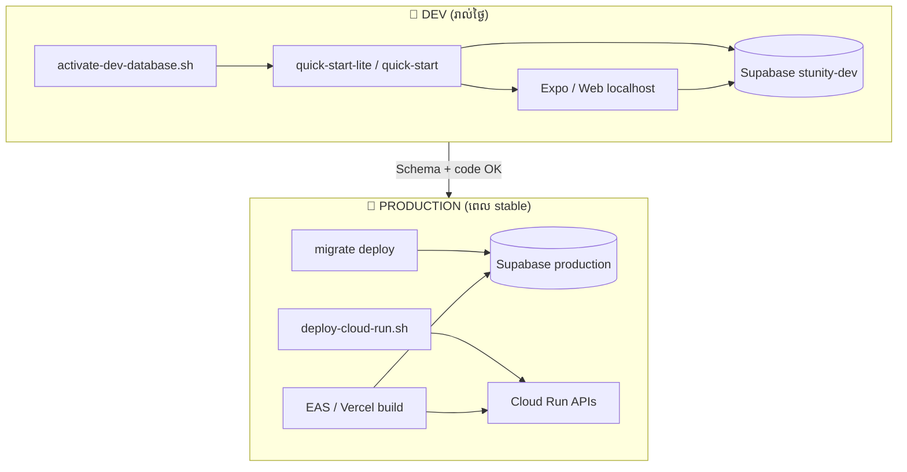
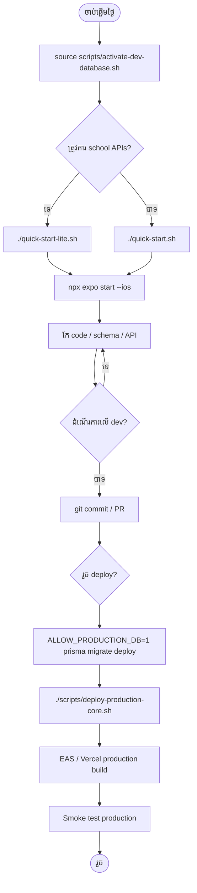

# លំហូរការងារ Dev → Production (Stunity Enterprise)

**ធ្វើបច្ចុប្បន្នភាព:** May 2026
**គោលដៅ:** អ្នកអភិវឌ្ឍន៍ — ពី run app ក្នុង **dev mode** រហូតដល់ **deploy production** ដោយមិនប៉ះ production ដោយចៃដោយ

ឯកសារនេះជា **flow ចម្បង**។ សម្រាប់ព័ត៌មានលម្អិត៖

| ប្រធានបទ | ឯកសារ |
|----------|--------|
| Pooler, quick-start, connections | [LOCAL_DEV.md](./LOCAL_DEV.md) |
| Block migrate/seed លើ prod | [DATABASE_SAFETY.md](./DATABASE_SAFETY.md) |
| Cloud Run, Vercel, EAS | [DEPLOYMENT_GUIDE.md](./DEPLOYMENT_GUIDE.md) |
| Seed test data | [SEEDING.md](./SEEDING.md) |

---

## 1. រូបភាពទូទៅ



| ស្រទាប់ | Dev | Production |
|--------|-----|------------|
| **Database** | `stunity-dev` (`ykvqgyrwizqjjzfuitto`) | Supabase project production |
| **Backend APIs** | Processes លើ Mac (`localhost:3001`…) | Google **Cloud Run** |
| **Env root** | `.env` + `.env.development.local` (ពេល activate) | root `.env` production URLs **តែមួយ** |
| **Mobile** | `apps/mobile/.env.local` | EAS secrets / production profile |
| **Web** | `localhost:3000` | Vercel |

**សំខាន់:** `quick-start` **មិន** deploy ទៅ Cloud Run។ វាដំណើរការ services **លើម៉ាស៊ីនអ្នក** ប៉ុណ្ណោះ។ Production Cloud Run **មិន** ឈប់/ចាប់ផ្តើមដោយ quick-start។

---

## 2. គោលការណ៍មាស (ចាំ 5 ចំណុច)

1. **Dev DB ដាច់ពី Production DB** — project Supabase ផ្សេង (`stunity-dev` vs production)។
2. **Activate dev មុន quick-start** — `source scripts/activate-dev-database.sh` → log ត្រូវមាន `🧪 Loaded .env.development.local`។
3. **កែ schema / seed លើ dev ជាមុន** — មិន `db push` / `seed:all` លើ production ពី laptop។
4. **Production migrate = `migrate deploy`** — មិន `db push --force-reset` លើ prod។
5. **Deploy Cloud Run** — root `.env` = production; script បដិសេធបើ `DATABASE_URL` ជា dev ref។

---

## 3. Phase 0 — រៀបចំម្តង (One-time setup)

### 3.1 តម្រូវការ

- Node.js, npm, Docker (ជម្រើស), Xcode + iOS Simulator (mobile)
- Supabase project **dev** (`stunity-dev`)
- root `.env` — production secrets + URLs (មិន commit)
- `gcloud` (ពេល deploy), `gh` (ជម្រើស)

### 3.2 បង្កើត env dev (gitignored)

```bash
# ពី repo root — password + API key ពី Supabase Dashboard
SUPABASE_DEV_DB_PASSWORD='...' \
SUPABASE_DEV_PUBLISHABLE_KEY='...' \
./scripts/setup-dev-supabase-env.sh
```

រក្សាទុក៖

| File | ខ្លឹមសារ |
|------|----------|
| `.env.development.local` | `DATABASE_URL`, `DIRECT_URL`, dev `SUPABASE_*` |
| `apps/mobile/.env.local` | `EXPO_PUBLIC_SUPABASE_URL`, `EXPO_PUBLIC_SUPABASE_ANON_KEY` |

### 3.3 Schema លើ dev DB ទទេ (ដំបូង)

```bash
source scripts/activate-dev-database.sh
./scripts/bootstrap-dev-database.sh    # prisma db push — DB ទទេ
./scripts/seed-dev-all.sh              # users, school, feed posts
```

### 3.4 Login សាក (mobile)

| Email | Password |
|-------|----------|
| `alex.chen@testhighschool.edu` | `SecurePass123!` |
| `john.doe@testhighschool.edu` | `SecurePass123!` |

---

## 4. Phase 1 — ចាប់ផ្តើមថ្ងៃត្រង់ (Daily dev)

**រាល់ terminal session ថ្មី** — ធ្វើតាមលំដាប់នេះ៖

### ជំហាន 1 — Activate dev database

```bash
cd /path/to/Stunity-Enterprise
source scripts/activate-dev-database.sh
```

✅ ត្រូវឃើញ៖ `Dev Supabase active (stunity-dev / ykvqgyrwizqjjzfuitto)`

### ជំហាន 2 — Start backend

**Feed / mobile (ណែនាំ):**

```bash
./quick-start-lite.sh
```

**School, grade, attendance, class, timetable (ពេលត្រូវការ):**

```bash
./quick-start.sh
# ឬ
SKIP_DB_MIGRATE=1 ./quick-start.sh
```

✅ ពិនិត្យ log៖

- `🧪 Loaded .env.development.local` — **មិនមែន** production DB
- `connection_limit=2` (lite) ឬ `3`
- Auth `3001`, Feed `3010` healthy

❌ បើឃើញតែ `📄 Loaded .env` គ្មាន `🧪` — **គ្រោះថ្នាក់**: អាចភ្ជាប់ production DB។ Run `activate-dev-database.sh` ម្តងទៀត។

### ជំហាន 3 — Mobile (terminal ថ្មី)

```bash
cd apps/mobile
npx expo start --ios --clear
# ឬ Android: npx expo start --android --clear
```

iOS Simulator ប្រើ `localhost` សម្រាប់ APIs ដោយស្វ័យប្រវត្តិ។

### ជំហាន 4 — Web (ជម្រើស)

```bash
# បើ quick-start-lite បើក web port 3000 រួច
open http://localhost:3000
```

---

## 5. Phase 2 — អភិវឌ្ឍន៍ feature (Loop)

```text
កែ code → schema? → migrate/push លើ DEV → restart services → សាក app → commit
```

### 5.1 កែ Prisma schema

```bash
source scripts/activate-dev-database.sh

# បង្កើត migration (dev)
cd packages/database
npx prisma migrate dev --name describe_your_change

# ឬ DB dev ទទេ / sync រហ័ស
npx prisma db push
```

**មិនធ្វើលើ production** ពី laptop លុះត្រាតែ Phase 6 (migrate deploy)។

### 5.2 កែ microservice (feed, class, attendance, …)

1. កែ `services/<name>-service/src/...`
2. Restart service ដែលផ្លាស់ប្តូរ (ឬ stop quick-start `Ctrl+C` → start ម្តងទៀត)
3. សាក endpoint៖ `curl http://localhost:3010/health` (feed), ជាដើម

| Service | Port |
|---------|------|
| auth-service | 3001 |
| feed-service | 3010 |
| notification-service | 3013 |
| learn-service | 3018 |
| class-service | 3005 |
| attendance-service | 3008 |
| school-service | 3002 |

### 5.3 កែ mobile (`apps/mobile`)

1. កែ screens / stores / API clients
2. `npx expo start --clear` បន្ទាប់ផ្លាស់ env
3. Realtime feed ប្រើ **dev** `EXPO_PUBLIC_SUPABASE_*` ពី `.env.local`

### 5.4 Seed / test data បន្ថែម (dev តែប៉ុណ្ណោះ)

```bash
source scripts/activate-dev-database.sh
npm run seed:feed
# ឬ
./scripts/seed-dev-all.sh
```

---

## 6. Phase 3 — ផ្ទៀងផ្ទាត់លើ dev (Definition of done)

មុនគិតថា “រួច” សម្រាប់ production៖

### Checklist មុខងារ

- [ ] Login / logout
- [ ] Feed load, post, like, comment (បើផ្លាស់ feed)
- [ ] Realtime “new posts” (បើផ្លាស់ realtime)
- [ ] Class / attendance / grade flows (បើផ្លាស់ school stack)
- [ ] Learn / courses (បើផ្លាស់ learn-service)
- [ ] គ្មាន error ថ្នាក់ក្នុង Metro / service logs

### Checklist បច្ចេកទេស

- [ ] Terminal quick-start បង្ហាញ `🧪 Loaded .env.development.local`
- [ ] Migration files committed (`packages/database/prisma/migrations/`)
- [ ] `npm run type-check` / tests ពាក់ព័ន្ធ (បើមាន)
- [ ] មិន commit `.env`, `.env.development.local`, `apps/mobile/.env.local`

---

## 7. Phase 4 — រៀបចំមុន production

### 7.1 បិទ dev mode សម្រាប់ deploy

Deploy **មិន** ប្រើ `STUNITY_USE_DEV_DB=1`។

```bash
# terminal ថ្មី — មិន source activate-dev-database.sh
cd /path/to/Stunity-Enterprise
# ធានាថា .env មាន production DATABASE_URL, JWT_SECRET, R2, ...
```

### 7.2 Review migration

```bash
# មើល migrations ដែលនឹងឡើង prod
ls packages/database/prisma/migrations/

# សាក status លើ production (ប្រយ័ត្ន — read-only check)
# DIRECT_URL + DATABASE_URL = production ក្នុង .env
npx prisma migrate status --schema=packages/database/prisma/schema.prisma
```

### 7.3 ជ្រើស services ដែលត្រូវ deploy

| Profile | Command | Services |
|---------|---------|----------|
| Core (mobile + feed) | `./scripts/deploy-production-core.sh` | auth, feed, notification, learn |
| មួយ service | `./scripts/deploy-cloud-run.sh feed-service` | តាមអ្វីដែលផ្លាស់ |
| Full | `./scripts/deploy-cloud-run.sh` | ទាំងអស់ (ថ្លៃខ្ពស់) |

---

## 8. Phase 5 — Production database schema

**លំដាប់:** schema production **មុន** ឬ **ជាមួយ** deploy code ដែលពឹង schema ថ្មី (មិន deploy code ថ្មីមុន migrate)។

```bash
# root .env = PRODUCTION URLs
# មិន set STUNITY_USE_DEV_DB=1

ALLOW_PRODUCTION_DB=1 \
npx prisma migrate deploy --schema=packages/database/prisma/schema.prisma
```

✅ ត្រូវឃើញ migrations applied
❌ **កុំ** `prisma db push --force-reset` លើ production
❌ **កុំ** `npm run seed:all` លើ production (លុះត្រាតែ runbook ពិសេស)

បន្ទាប់ migrate — ពិនិត្យ RLS policies លើ tables ថ្មី ([DEPLOYMENT_GUIDE.md](./DEPLOYMENT_GUIDE.md) § RLS)។

---

## 9. Phase 6 — Deploy backend (Google Cloud Run)

### 9.1 Prerequisites

```bash
gcloud auth login
gcloud config set project YOUR_GCP_PROJECT
# root .env ពេញលេញ production
```

### 9.2 Deploy core APIs

```bash
./scripts/deploy-production-core.sh
```

Defaults៖ auth + feed **min-instances=1**, max instances ទាប, `PRISMA_CONNECTION_LIMIT=3`។

### 9.3 Deploy services ផ្សេង (ឧ. class, attendance)

```bash
./scripts/deploy-cloud-run.sh class-service attendance-service school-service
```

Script **បរាជ័យ** បើ `DATABASE_URL` មាន dev ref `ykvqgyrwizqjjzfuitto`។

### 9.4 Smoke test production APIs

```bash
curl https://YOUR_AUTH_URL/health
curl https://YOUR_FEED_URL/health
```

---

## 10. Phase 7 — Production clients

### 10.1 Web (Vercel)

- Env៖ `NEXT_PUBLIC_*` → **Cloud Run URLs** (មិន localhost)
- Deploy branch តាម Vercel workflow
- សាក login + feature ដែលផ្លាស់ប្តូរ

### 10.2 Mobile (Expo EAS)

- EAS profile **production** — Supabase production URL + anon key
- **មិន** ship `apps/mobile/.env.local` (dev)
- Build៖ `eas build --platform ios` / `android` (តាម runbook ក្រុម)

---

## 11. Phase 8 — Post-deploy verification

| # | ការពិនិត្យ |
|---|------------|
| 1 | Production login (user ពិត) |
| 2 | Feed / API endpoints សំខាន់ |
| 3 | Supabase Dashboard → Connections (មិន overload) |
| 4 | Cloud Run logs — គ្មាន error spike |
| 5 | Mobile build production — smoke test device |

Rollback plan៖ redeploy revision មុន (Cloud Run) + **មិន** rollback migration ដោយគ្មានแผน (migrations ត្រូវ plan មុន)

---

## 12. តារាង command រហ័ស

| គោលបំណង | Command |
|----------|---------|
| Activate dev | `source scripts/activate-dev-database.sh` |
| Start lite stack | `./quick-start-lite.sh` |
| Start full stack | `./quick-start.sh` |
| iOS app | `cd apps/mobile && npx expo start --ios --clear` |
| Seed dev | `./scripts/seed-dev-all.sh` |
| Bootstrap empty dev DB | `./scripts/bootstrap-dev-database.sh` |
| Prisma migrate (dev) | `cd packages/database && npx prisma migrate dev` |
| Migrate (production) | `ALLOW_PRODUCTION_DB=1 npx prisma migrate deploy --schema=packages/database/prisma/schema.prisma` |
| Deploy core | `./scripts/deploy-production-core.sh` |
| Deploy one service | `./scripts/deploy-cloud-run.sh feed-service` |

---

## 13. កំហុសញឹកញាប់

| បញ្ហា | មូលហេតុ | ដំណោះស្រាយ |
|-------|---------|------------|
| Local app ប៉ះ production data | Run quick-start ដោយគ្មាន `activate-dev-database.sh` | `source scripts/activate-dev-database.sh` មុន start |
| `migrate deploy` blocked | `db-safety-check` | Dev: `STUNITY_USE_DEV_DB=1` · Prod: `ALLOW_PRODUCTION_DB=1` |
| Deploy blocked (dev ref) | `.env` ឬ shell នៅ dev mode | Terminal ថ្មី, production `.env` តែមួយ |
| Feed ទទេ | មិន seed | `npm run seed:feed` លើ dev |
| Realtime មិនដំណើរការ | publishable vs anon key | យក **anon JWT** ពី Supabase → `.env.local` |
| Connection timeout Supabase | ច្រើន services + pool ធំ | ប្រើ `quick-start-lite.sh`, `PRISMA_CONNECTION_LIMIT=2` |

---

## 14. Flowchart ពេញ (សង្ខេប)



---

## 15. ឯកសារពាក់ព័ន្ធ

- [PRODUCTION_ARCHITECTURE_LONG_TERM.md](./PRODUCTION_ARCHITECTURE_LONG_TERM.md) — **long-term:** many services + one Supabase, consolidation roadmap
- [LOCAL_DEV.md](./LOCAL_DEV.md) — pooler, lite vs full quick-start
- [SEEDING.md](./SEEDING.md) — អ្វី seed script នីមួយធ្វើ
- [DATABASE_SAFETY.md](./DATABASE_SAFETY.md)
- [DEPLOYMENT_GUIDE.md](./DEPLOYMENT_GUIDE.md)
- [REALTIME_ARCHITECTURE.md](./REALTIME_ARCHITECTURE.md)
