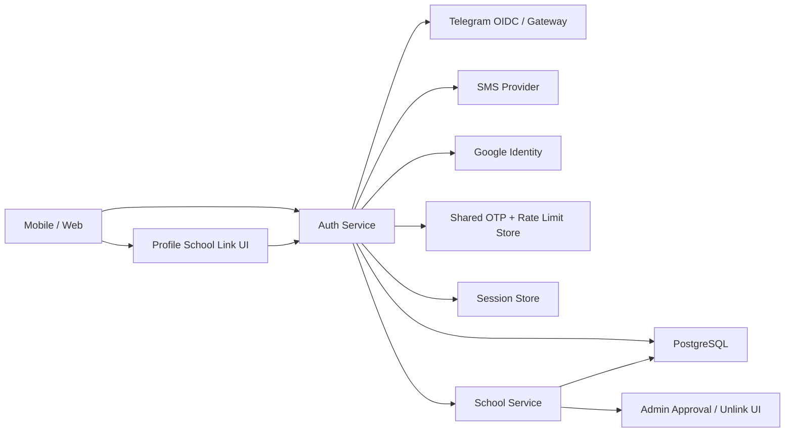
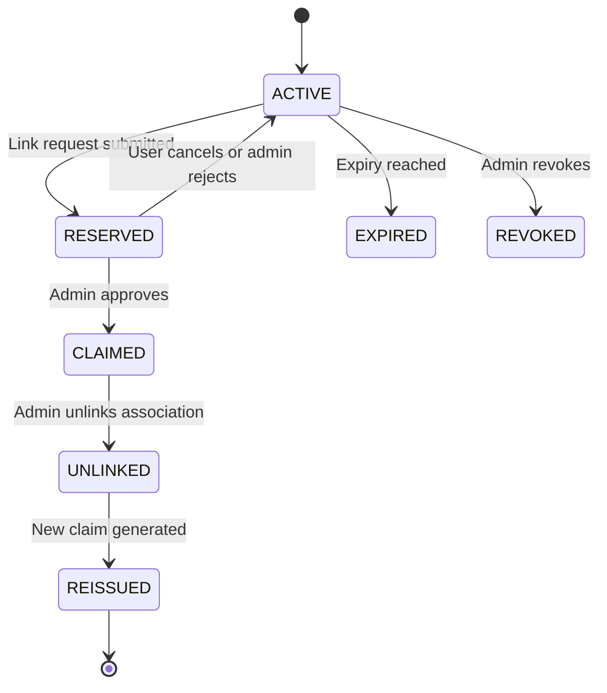

# Stunity Passwordless Authentication and School Linking

**Status:** Approved product direction; implementation specification
**Version:** 1.0
**Created:** July 20, 2026
**Owners:** Auth, Mobile, Web, School Platform, Security, QA
**Primary services:** `services/auth-service`, `services/school-service`
**Primary clients:** `apps/mobile`, `apps/web`

> This document is the authoritative implementation plan for phone-first passwordless authentication, Telegram authentication, optional passkeys, deferred school linking, and safe school-profile unlinking in Stunity.

## 1. Approved product decisions

The following decisions are considered settled unless a later architecture decision record explicitly supersedes them.

1. Every new user starts with a **General Stunity Account**.
2. Standard registration must not ask whether the user wants to join a school and must not block on a Claim Code.
3. A new user should reach lightweight onboarding or the News Feed immediately after verifying a login method and providing the minimum required profile information.
4. A General Account can link to a school later from the Profile screen without creating another account.
5. A user arriving from a school Claim QR/deep link is the exception: preserve the Claim Code through authentication and continue into the claim confirmation flow after the General Account is available.
6. The default authentication entry is **phone-first**.
7. Prefer Telegram delivery when the phone can receive a Telegram Gateway verification; offer SMS as the fallback.
8. Also provide **Continue with Telegram** using Telegram OIDC for users who prefer one-tap authorization.
9. Google, email, and legacy password remain secondary authentication options.
10. After the first successful verification, offer passkey enrollment using user-facing language such as “Use fingerprint or face next time.” Passkeys are optional, not a registration blocker.
11. Authentication proves control of an account. Claim Code plus school approval proves association with a school roster profile. These concerns must remain separate.
12. A school administrator can safely unlink an incorrectly linked account. Unlinking must preserve the General Account and school academic records, retire the old claim, issue a new claim when requested, invalidate school access, and write an audit trail.

### Khmer product summary

> គ្រប់ account ថ្មីចាប់ផ្តើមជា General Stunity Account។ អ្នកប្រើអាចចូល Feed បានភ្លាម ហើយ Link School នៅលើ Profile ពេលក្រោយ។ Phone/Telegram ជា default, SMS ជា fallback, Passkey ជាជម្រើសសម្រាប់ Fingerprint/Face ID និង Claim Code + Admin Approval ទើបបញ្ជាក់ School Student Profile។

## 2. Goals and non-goals

### 2.1 Goals

- Remove password memorization as a requirement for new users.
- Make registration understandable for students, parents, teachers, and older adults.
- Minimize time-to-first-feed for General Accounts.
- Support users who do not have Telegram, Google, or email.
- Minimize paid SMS usage without reducing account recovery coverage.
- Prevent a recycled phone number from automatically taking ownership of a school profile.
- Ensure one human can keep one Stunity account and attach multiple safe login methods.
- Prevent duplicate accounts caused by separate general and school registration flows.
- Make claim approval, rejection, cancellation, unlinking, and reissuing auditable and concurrency-safe.
- Preserve compatibility with existing microservices while the identity model evolves.

### 2.2 Non-goals for the first release

- Removing password login from existing accounts.
- Migrating every downstream service to a new membership authorization model in one release.
- Using Telegram or SMS as proof of a student's real-world school identity.
- Automatically merging two existing accounts based only on matching email or phone.
- Supporting multiple simultaneously active schools per user in the initial UI.
- Replacing current enterprise SSO for school administrators.

## 3. Current repository baseline and blocking defects

Implementation must begin by correcting the following repository realities.

| Area | Current behavior | Required correction |
|---|---|---|
| General registration | `/auth/register` creates a password account with `accountType: SOCIAL_ONLY` | Use a compatible account classification; password-based General Accounts must remain able to log in |
| Password login | Rejects most `SOCIAL_ONLY` accounts even if a usable password hash exists | Separate school affiliation from authentication method |
| Web social buttons | Navigate to GET routes, while provider verification routes accept POST tokens | Implement a complete OAuth/OIDC client flow and callback contract |
| Web provider payload | Sends a generic `{ token }` | Send provider-specific verified artifacts or standardize the backend contract |
| Mobile social buttons | Display configuration alerts instead of authenticating | Implement native/browser provider flows |
| Social + Claim Code | Social route directly applies `schoolId` and claims the code | Route every school claim through the same pending/approval workflow |
| Provider account linking | Existing user may be linked automatically by matching email | Require an authenticated link or verified ownership challenge; never auto-link an unverified local email |
| Claim lookup | Pending claim collisions are found by scanning `pendingLinkData` JSON | Introduce a normalized School Link Request and database constraints |
| Claim validation | Public validation can return full name, date of birth, gender, and class data | Authenticate first when possible and return only a masked confirmation view |
| Claim management | Supports pending rejection and unclaimed-code revocation | Add approved-link unlinking, access revocation, audit, and claim reissue |
| Phone identity | Raw strings are stored as unique values | Normalize to E.164 and resolve duplicates before enforcing canonical uniqueness |
| Rate limiting | In-memory limiter is process-local | Use a shared rate-limit and OTP challenge store for multiple instances |
| Sessions | Long-lived signed access and refresh tokens cannot be selectively revoked reliably | Add server-side sessions, refresh rotation, and school-access invalidation |

Relevant implementation locations:

- `services/auth-service/src/index.ts`
- `services/auth-service/src/routes/socialAuth.routes.ts`
- `services/auth-service/src/routes/passwordReset.routes.ts`
- `services/school-service/src/index.ts`
- `packages/database/prisma/schema.prisma`
- `apps/mobile/src/screens/auth/`
- `apps/mobile/src/screens/profile/components/LinkSchoolCard.tsx`
- `apps/web/src/app/[locale]/auth/`
- `apps/web/src/app/[locale]/admin/claim-codes/page.tsx`

## 4. Core domain principles

### 4.1 One person, one durable Stunity account

The `User` record is the durable social and learning identity. It owns personal profile data, posts, follows, course progress, and authentication methods. It must survive school linking and unlinking.

### 4.2 Authentication method is not school identity

Phone, Telegram, Google, email, password, and passkey are authentication methods. None of them independently proves which `Student` or `Teacher` record belongs to the user.

### 4.3 School membership is attachable and reversible

A School Link attaches a General Account to a school roster profile after approval. It can later be unlinked without deleting either the General Account or the roster profile.

### 4.4 Academic records remain with the roster profile

Attendance, grades, class assignment, timetable context, and other institutional records belong to the school `Student` or `Teacher` profile. Personal feed and learning data belong to `User`.

### 4.5 Never merge accounts using an identifier alone

Matching phone or email is a discovery signal, not sufficient authorization to merge. Account linking requires proof of control of both sides or an approved recovery workflow.

## 5. Target user experience

### 5.1 Standard phone-first registration

1. User opens Stunity.
2. The first screen presents a Cambodia-friendly phone input with `+855` selected.
3. User enters a local or international-format phone number.
4. Client normalizes and previews the canonical number.
5. Backend creates an OTP challenge and selects a channel:
   - Telegram Gateway when deliverable and permitted.
   - SMS when Telegram is unavailable or the user explicitly selects SMS.
6. User enters the six-digit code.
7. If the verified phone belongs to an existing authentication identity, sign in to the existing `User`.
8. If it is new, create a General Account and request only minimum profile data:
   - Display/first name.
   - Last name when required by product policy.
   - Terms and privacy consent.
9. Navigate to lightweight onboarding or the News Feed.
10. Offer optional passkey enrollment after the user is safely signed in.

Do not request a Claim Code, school, class, role, date of birth, or password during this standard flow.

### 5.2 Continue with Telegram OIDC

1. User taps **Continue with Telegram**.
2. Client opens Telegram authorization using OIDC with PKCE and nonce.
3. Backend validates issuer, audience, signature, nonce, timestamps, and authorization code exchange.
4. Use Telegram's stable provider subject as the credential identifier.
5. Request phone scope only with explicit user consent and only when product behavior needs it.
6. Existing credential signs into its `User`; new credential creates a General Account.
7. Do not use the Telegram phone number to silently merge with another account.

### 5.3 Returning user with a passkey

If a passkey is registered and supported on the device/browser:

1. Present **Use fingerprint or face** before OTP entry or through conditional UI.
2. Complete WebAuthn assertion verification.
3. Issue or resume a server-side Stunity session.
4. Fall back to Telegram/phone when passkey authentication is unavailable.

Passkey is the preferred returning-user path because it has no per-login message cost and does not require memorization. It must remain optional on shared or unsupported devices.

### 5.4 General Account linking from Profile

1. Profile displays **Link your school** when there is no approved school link.
2. User scans a QR code or enters a manual Claim Code.
3. Backend validates the claim status and returns a masked preview.
4. User explicitly confirms the school and roster profile.
5. Backend creates a normalized `SchoolLinkRequest` with status `PENDING`.
6. User continues using General Account features while waiting.
7. Admin approves or rejects the request.
8. On approval, the same account becomes school-linked; no new account is created.

### 5.5 Claim QR/deep-link entry

When the app is opened with a Claim QR/deep link:

1. Store the Claim Code in encrypted/temporary client state.
2. Authenticate or create a General Account using the normal passwordless flow.
3. Restore the pending Claim Code.
4. Show the masked claim confirmation screen.
5. Submit a pending School Link Request.

The user must be able to cancel and enter the General Account without claiming.

### 5.6 Pending, rejected, and cancelled requests

- A user with a pending request sees status, school name, submitted time, and **Cancel request**.
- A rejected request returns the account to an unlinked General state and displays a safe reason.
- Cancelling or rejecting releases any claim reservation.
- A user can then submit another Claim Code.

### 5.7 Approved link unlinking

An authorized school administrator can unlink a wrongly approved association. The operation must:

- Preserve the `User` and its general/social data.
- Preserve the school roster profile and academic records.
- Remove school authorization from the user.
- Retire the old Claim Code instead of reactivating it.
- Optionally issue a new claim for the same roster profile.
- Invalidate active school-scoped sessions and cached permissions.
- Notify the affected user.
- Record an immutable audit event.

## 6. Authentication method priority

| Priority | Method | Intended use | Recurring delivery cost |
|---:|---|---|---:|
| 1 | Phone with Telegram Gateway delivery | Default first verification when supported | $0.01 per delivered code at the time of this document |
| 2 | Phone with SMS delivery | Coverage fallback | Country/provider dependent and materially higher |
| 3 | Telegram OIDC | One-tap alternative | No per-login charge listed by Telegram at the time of this document |
| 4 | Passkey | Preferred returning login after enrollment | No per-authentication message cost |
| 5 | Google | Secondary federated login | No OTP message cost |
| 6 | Email OTP/magic link | Recovery and alternative | Email provider plan cost |
| 7 | Password | Existing/legacy accounts | No message cost; retained for compatibility |

Pricing is operational context, not a hard-coded guarantee. Revalidate before vendor commitment:

- Telegram Gateway: <https://core.telegram.org/gateway>
- Telegram Login: <https://core.telegram.org/bots/telegram-login>
- Google Identity Platform phone pricing: <https://cloud.google.com/identity-platform/pricing>
- Twilio Verify: <https://www.twilio.com/en-us/user-authentication-identity/verify>
- Resend: <https://resend.com/pricing>

## 7. Target architecture



### 7.1 Auth Service responsibilities

- Normalize identifiers.
- Create and verify OTP challenges.
- Verify Telegram, Google, passkey, and legacy password credentials.
- Find or create the durable General Account.
- Manage credential linking and unlinking.
- Create, rotate, and revoke sessions.
- Submit and query School Link Requests.
- Produce security and audit events.

### 7.2 School Service responsibilities

- Generate roster-bound Claim Codes.
- List and inspect school-specific requests.
- Authorize school admins.
- Approve, reject, unlink, and reissue claims through transactional domain functions.
- Keep institutional records attached to the roster profile.

### 7.3 Shared domain functions

Avoid duplicating claim behavior in Express route handlers. Create reusable domain services such as:

- `IdentityService`
- `OtpChallengeService`
- `SessionService`
- `SchoolLinkService`
- `ClaimCodeService`
- `AccountRecoveryService`
- `AuthAuditService`

All password, social, Telegram, phone, and passkey flows must call the same account resolution and school-linking services.

## 8. Data model

The migration should be incremental. Existing `User.schoolId`, `User.studentId`, `User.teacherId`, and `User.role` can remain as compatibility projections during the transition.

### 8.1 Extend social provider support

Add `TELEGRAM` to `SocialProvider`. Continue using `SocialAccount` for federated/OIDC credentials during the first release.

Required rules:

- `@@unique([provider, providerUserId])`
- Store provider subject and verified claims.
- Do not store provider access tokens unless a feature requires them.
- Encrypt secrets/tokens when storage is unavoidable.
- Do not persist an unrestricted raw provider profile for routine debugging.

### 8.2 VerifiedContact

Recommended Prisma shape:

```prisma
enum ContactType {
  PHONE
  EMAIL
}

model VerifiedContact {
  id              String      @id @default(cuid())
  userId          String
  type            ContactType
  normalizedValue String
  displayValue    String?
  verifiedAt      DateTime
  isPrimary       Boolean     @default(false)
  disabledAt      DateTime?
  createdAt       DateTime    @default(now())
  updatedAt       DateTime    @updatedAt
  user            User        @relation(fields: [userId], references: [id], onDelete: Cascade)

  @@unique([type, normalizedValue])
  @@index([userId, type])
  @@map("verified_contacts")
}
```

Keep `User.phone` and `User.email` as compatibility/profile projections initially. New authentication logic should resolve through `VerifiedContact` after migration.

### 8.3 PasskeyCredential

```prisma
model PasskeyCredential {
  id                  String   @id @default(cuid())
  userId              String
  credentialId        String   @unique
  publicKey           Bytes
  counter             BigInt   @default(0)
  transports          String[]
  deviceLabel         String?
  backedUp             Boolean  @default(false)
  createdAt            DateTime @default(now())
  lastUsedAt           DateTime?
  revokedAt            DateTime?
  user                 User     @relation(fields: [userId], references: [id], onDelete: Cascade)

  @@index([userId, revokedAt])
  @@map("passkey_credentials")
}
```

Store challenges in a shared short-lived store, not in the credential row.

### 8.4 AuthSession

```prisma
model AuthSession {
  id                    String   @id @default(cuid())
  userId                String
  refreshTokenHash      String   @unique
  deviceId              String?
  deviceName            String?
  ipAddress             String?
  userAgent             String?
  schoolAccessVersion   Int      @default(0)
  createdAt             DateTime @default(now())
  lastUsedAt            DateTime @default(now())
  expiresAt             DateTime
  revokedAt             DateTime?
  revokeReason          String?
  user                   User     @relation(fields: [userId], references: [id], onDelete: Cascade)

  @@index([userId, revokedAt])
  @@index([expiresAt])
  @@map("auth_sessions")
}
```

Refresh tokens must be random, opaque, stored hashed, rotated on use, and revoked on reuse detection. Access tokens should be short lived and refreshed invisibly.

Add `User.schoolAccessVersion Int @default(0)` during the migration. Include the value and `sessionId` in access tokens. The authorization middleware must reject a token whose school-access version no longer matches the current User value. Increment the User version when a school link is unlinked, a school account is suspended, or a security incident requires immediate school-access invalidation. `AuthSession.schoolAccessVersion` is the session snapshot used for refresh and device management; it is not a substitute for the User-level version.

### 8.5 SchoolLinkRequest

```prisma
enum SchoolLinkRequestStatus {
  PENDING
  APPROVED
  REJECTED
  CANCELLED
  UNLINKED
}

model SchoolLinkRequest {
  id               String                  @id @default(cuid())
  userId           String
  schoolId         String
  claimCodeId      String
  studentId        String?
  teacherId        String?
  requestedRole    UserRole
  status           SchoolLinkRequestStatus @default(PENDING)
  submittedAt      DateTime                @default(now())
  reviewedAt       DateTime?
  reviewedByUserId String?
  reviewReason     String?
  unlinkedAt       DateTime?
  unlinkedByUserId String?
  unlinkReason     String?
  metadata         Json?

  user             User      @relation(fields: [userId], references: [id], onDelete: Cascade)
  school           School    @relation(fields: [schoolId], references: [id], onDelete: Cascade)
  claimCode        ClaimCode @relation(fields: [claimCodeId], references: [id])

  @@index([schoolId, status, submittedAt])
  @@index([userId, status])
  @@index([claimCodeId, status])
  @@map("school_link_requests")
}
```

Add PostgreSQL partial unique indexes in a migration to enforce:

- At most one `PENDING` School Link Request for a user.
- At most one `PENDING` request for a Claim Code.
- At most one active approved user per roster profile.

Do not use `pendingLinkData` JSON as the long-term source of truth. During migration, dual-write normalized requests and the legacy projection until all clients are updated.

### 8.6 SchoolMembership as the long-term authorization model

Introduce this after School Link Request V2 is stable:

```prisma
enum SchoolMembershipStatus {
  ACTIVE
  SUSPENDED
  UNLINKED
}

model SchoolMembership {
  id           String                 @id @default(cuid())
  userId       String
  schoolId     String
  studentId    String?                @unique
  teacherId    String?                @unique
  role         UserRole
  status       SchoolMembershipStatus @default(ACTIVE)
  linkedAt     DateTime               @default(now())
  unlinkedAt   DateTime?
  linkRequestId String?               @unique
  createdAt    DateTime               @default(now())
  updatedAt    DateTime               @updatedAt

  @@unique([userId, schoolId])
  @@index([schoolId, role, status])
  @@map("school_memberships")
}
```

Until every service reads membership, continue projecting the active primary membership to `User.schoolId`, `User.studentId`, `User.teacherId`, and `User.role` transactionally.

### 8.7 Claim and auth audit events

Create immutable event records for:

- OTP requested, sent, failed, verified, and rate-limited.
- Credential added, used, removed, and recovered.
- Session created, rotated, revoked, and reuse-detected.
- Claim viewed, submitted, approved, rejected, cancelled, unlinked, and reissued.
- Admin identity, reason, before/after identifiers, request ID, IP, and timestamp.

Never log OTP values, provider tokens, refresh tokens, Claim Code plaintext, passwords, or sensitive raw provider responses.

## 9. API contracts

All new endpoints use a consistent envelope:

```json
{
  "success": true,
  "data": {},
  "error": null,
  "requestId": "req_..."
}
```

Errors must contain a stable machine code and localized clients should map that code to user-facing text.

### 9.1 Start OTP

`POST /auth/otp/start`

```json
{
  "phone": "+85512123456",
  "preferredChannel": "AUTO",
  "deviceId": "device_...",
  "purpose": "SIGN_IN"
}
```

`preferredChannel`: `AUTO`, `TELEGRAM`, or `SMS`.

Response:

```json
{
  "success": true,
  "data": {
    "challengeId": "otp_...",
    "channel": "TELEGRAM",
    "maskedDestination": "+855 12 *** 456",
    "expiresAt": "2026-07-20T10:05:00Z",
    "resendAt": "2026-07-20T10:01:00Z",
    "smsFallbackAvailable": true
  }
}
```

The response must not disclose whether an account already exists.

### 9.2 Verify OTP

`POST /auth/otp/verify`

```json
{
  "challengeId": "otp_...",
  "code": "123456",
  "deviceId": "device_..."
}
```

For an existing verified contact, return the normal session and user. For a new contact, return a short-lived enrollment token that can create a General Account after minimum profile completion.

Do not create an empty user record before the challenge is verified.

### 9.3 Complete General Account enrollment

`POST /auth/enroll`

```json
{
  "enrollmentToken": "...",
  "firstName": "Sokha",
  "lastName": "Chan",
  "acceptedTermsVersion": "2026-07"
}
```

Server assigns the safe General Account role. Client input must not assign school roles or elevated permissions.

### 9.4 Telegram OIDC

- `GET /auth/oidc/telegram/start`
- `GET /auth/oidc/telegram/callback`
- Native clients may exchange a provider authorization result through a documented POST endpoint.

Use Authorization Code Flow with PKCE. Verify `iss`, `aud`, `exp`, `iat`, nonce, signature, and redirect URI.

### 9.5 Passkeys

- `POST /auth/passkeys/register/options` — authenticated
- `POST /auth/passkeys/register/verify` — authenticated
- `POST /auth/passkeys/authenticate/options`
- `POST /auth/passkeys/authenticate/verify`
- `GET /auth/me/passkeys`
- `DELETE /auth/me/passkeys/:credentialId` — step-up authentication required

Use a maintained WebAuthn server library rather than implementing cryptography manually.

### 9.6 Authentication identities

- `GET /auth/me/identities`
- `POST /auth/me/identities/phone/start`
- `POST /auth/me/identities/phone/verify`
- `POST /auth/me/identities/telegram/link`
- `DELETE /auth/me/identities/:identityId`

Do not allow removal of the last usable authentication/recovery method.

### 9.7 School Link APIs

- `POST /auth/claim-codes/preview` — authenticated; masked response
- `POST /auth/school-links` — submit request
- `GET /auth/school-links/current`
- `POST /auth/school-links/current/cancel`
- `GET /auth/admin/school-links?schoolId=...&status=PENDING`
- `POST /auth/admin/school-links/:requestId/approve`
- `POST /auth/admin/school-links/:requestId/reject`
- `POST /auth/admin/school-links/:requestId/unlink`

Example unlink request:

```json
{
  "reasonCode": "WRONG_STUDENT_PROFILE",
  "reason": "Student scanned a sibling's claim card.",
  "expectedUserId": "user_...",
  "expectedStudentId": "student_...",
  "reissueClaimCode": true
}
```

Require recent admin re-authentication for unlinking.

## 10. Claim state machine



The existing `ClaimCode` fields may represent these states during the first migration, but audit events must preserve transitions. A claimed code is never returned to active use; generate a new code after unlink.

### 10.1 Claim security rules

- Use roster-bound claims by default.
- Avoid generic claims that create incomplete roster records.
- Reduce default validity from the current long-lived period to a product-approved window, recommended 30 days for printed cards.
- Permit admin regeneration, which revokes the prior unclaimed code.
- Rate-limit claim preview attempts by user, device, IP, and code prefix.
- Return only school name, masked roster name, class label when necessary, and claim type.
- Never expose date of birth or gender in an unauthenticated preview.
- Require explicit confirmation before submission.

## 11. Transaction boundaries and concurrency

All approval, rejection, cancellation, unlink, and reissue operations must be idempotent and transactional.

### 11.1 Submit link request transaction

1. Lock/read User, Claim Code, roster profile, and any current request.
2. Verify User has no active school membership or pending request.
3. Verify Claim Code is active, unexpired, unrevoked, and roster-bound.
4. Verify the roster profile has no other active linked User.
5. Create `SchoolLinkRequest(PENDING)`.
6. Reserve the claim for that request.
7. Commit and publish a post-commit notification event.

### 11.2 Approve transaction

1. Lock the request, claim, user, and roster profile.
2. Revalidate school-admin scope and request status.
3. Revalidate that the claim and profile are not linked elsewhere.
4. Create/activate School Membership.
5. Update compatibility fields on `User`.
6. Mark the request approved and claim claimed.
7. Increment school-access/session version if needed.
8. Commit.
9. Notify after commit.

### 11.3 Unlink transaction

1. Lock active membership/request, user, roster profile, and Claim Code.
2. Verify admin belongs to the same school unless Super Admin.
3. Verify optimistic identifiers supplied by the client still match.
4. Mark membership and approved request `UNLINKED` with actor and reason.
5. Clear compatibility fields: `schoolId`, `studentId`, `teacherId`, organization fields, and school-derived permissions.
6. Assign safe General Account authorization.
7. Retire the old Claim Code and record an unlink event.
8. If requested, generate a new roster-bound Claim Code.
9. Increment `User.schoolAccessVersion`, revoke active sessions, and invalidate school-scoped cache entries.
10. Commit.
11. Notify user and administrators after commit.

If any step fails, none of the link, unlink, or reissue effects may persist.

## 12. Data ownership during unlink

| Data | After unlink |
|---|---|
| User profile and username | Preserve on General Account |
| Feed posts, follows, comments, likes | Preserve on General Account |
| General learning progress | Preserve on General Account |
| Authentication methods and passkeys | Preserve unless separately compromised |
| School membership and school permissions | Remove/deactivate immediately |
| Student ID and school roster profile | Preserve in school |
| Attendance, grades, class history | Preserve with Student profile |
| Old Claim Code | Retire permanently |
| New Claim Code | Generate for the roster profile when requested |
| Audit history | Preserve immutably |

## 13. OTP and messaging security

### 13.1 OTP defaults

- Six numeric digits.
- Five-minute expiry.
- One-time use.
- Maximum five verification attempts per challenge.
- Minimum 60 seconds before resend.
- A resend must invalidate or supersede the previous code according to one documented rule.
- Store only an HMAC/hash of the code and compare in constant time.
- Bind challenge to normalized destination, purpose, and a device/session nonce.
- Never return the OTP in API responses or logs outside local test-only tooling.

### 13.2 Abuse controls

Enforce shared limits by:

- Phone number.
- User when known.
- IP and subnet.
- Device/app installation ID.
- ASN/country risk when available.
- Challenge purpose.
- Daily provider budget.

Add App Check/Play Integrity/App Attest or an equivalent risk signal before broad SMS rollout. Use CAPTCHA only when risk requires it; avoid making it the normal older-adult experience.

### 13.3 Channel selection

For `AUTO`:

1. Call Telegram `checkSendAbility` using the canonical phone number.
2. If deliverable, continue with the same request ID so the fee is not duplicated.
3. If unavailable, return a safe option to use SMS.
4. Do not silently spend on multiple channels for one user action.
5. Record delivery, fallback, conversion, refund, and cost metadata without recording OTP content.

### 13.4 Provider abstraction

Define an internal interface so vendors can change without changing routes:

```ts
interface VerificationChannelProvider {
  canSend(destination: string): Promise<SendAbility>;
  send(input: SendVerificationInput): Promise<SendReceipt>;
  verify(input: VerifyCodeInput): Promise<VerifyResult>;
  revoke?(receiptId: string): Promise<void>;
}
```

Implement Telegram Gateway and one SMS provider behind this interface.

## 14. Phone-number lifecycle and recycled-number protection

Phone possession can change. Therefore:

- Never use phone as the school roster identity.
- Keep immutable internal `userId` and provider credential IDs.
- Treat a login from a new device as a risk signal, not a guaranteed attack.
- Notify existing sessions about new-device sign-in.
- Require step-up authentication for phone changes, credential deletion, account merge, and school unlink.
- Apply a security hold or admin-assisted recovery for high-risk phone replacement on school-linked accounts.
- Encourage at least one additional method: passkey, Telegram OIDC, Google, or verified email.
- Allow school-assisted recovery to reconnect a user to the correct roster profile without creating another General Account.
- Never allow a newly verified recycled number alone to change an existing school link.

## 15. Session design

The user should remain signed in without repeatedly paying for OTP.

Recommended defaults:

- Access token: 15 minutes.
- Rotating refresh session: 90 days of inactivity, configurable by policy.
- Mobile secure storage for refresh token.
- Web secure, HTTP-only, SameSite cookie where architecture permits.
- Refresh token rotation on every use.
- Reuse detection revokes the session family.
- Device/session management screen with remote sign-out.
- School membership version checked when issuing refreshed access tokens.
- Unlink and suspension immediately revoke or invalidate school access.

Long sessions improve convenience only when server-side revocation is reliable. A 30-day self-contained access token must not retain school authorization after unlink.

## 16. Client implementation requirements

### 16.1 Mobile

- One phone-first screen with Cambodia as the default region, not a hard-coded country restriction.
- Accept local formats such as `012...`, normalize on the client for preview, and normalize again on the server as authority.
- Numeric OTP keyboard and platform autofill attributes.
- Telegram-branded delivery explanation when Telegram is selected.
- **I did not receive a code** action with resend and SMS/Telegram fallback.
- Preserve Claim deep-link state across auth navigation and app restart for a short period.
- Store sessions only in secure storage.
- Offer passkey with plain language after successful sign-in.
- Support shared-device users by providing **Not now** and clear account switching/sign-out.
- Provide Khmer and English text from launch.

### 16.2 Web

- Use the same phone-first information architecture.
- Implement Telegram and Google callbacks, PKCE, state, and nonce correctly.
- Use WebAuthn passkey conditional UI when supported.
- Use accessible focus management, error announcements, and keyboard navigation.
- Avoid provider icon-only buttons without text or accessible labels.

### 16.3 Older-adult accessibility

- Minimum readable text size and high contrast.
- Large primary action targets.
- One decision per screen.
- Avoid technical terms such as “OIDC,” “credential,” and “passkey” in user copy.
- Show exactly where a Telegram code can be found.
- Do not clear the phone field after recoverable errors.
- Provide human-readable recovery and school-support guidance.

Recommended copy:

- **Continue with phone number**
- **We sent a 6-digit code to Telegram**
- **Send by SMS instead**
- **Use fingerprint or face next time**
- **Link your school**
- **Your school link is waiting for approval**

## 17. Privacy and compliance

- Collect only authentication data required for the selected method.
- Record consent version and time for Terms and Privacy Policy.
- Explain phone and Telegram processing before first send/authorization.
- Define retention for OTP metadata, failed attempts, provider claims, and auth audit events.
- Redact phone numbers in routine logs and support tools.
- Restrict admin visibility to users and claims within their school.
- Do not include date of birth, gender, full phone, Claim Code, or private provider data in analytics events.
- Provide account deletion and credential removal behavior consistent with school record-retention requirements.

## 18. Observability and service objectives

### 18.1 Required metrics

- `auth_otp_started_total{channel,purpose}`
- `auth_otp_delivered_total{channel}`
- `auth_otp_verified_total{channel}`
- `auth_otp_failed_total{channel,reason}`
- `auth_otp_fallback_total{from,to}`
- `auth_verification_cost_usd{channel}`
- `auth_login_completed_total{method,new_or_returning}`
- `auth_login_duration_ms{method}`
- `auth_passkey_enrollment_total{result}`
- `auth_passkey_login_total{result}`
- `school_link_submitted_total`
- `school_link_approved_total`
- `school_link_rejected_total{reason_code}`
- `school_link_unlinked_total{reason_code}`
- `school_claim_reissued_total`
- `auth_duplicate_account_reported_total`

Use bounded labels only; never use phone, email, user ID, Claim Code, or school name as metric labels.

### 18.2 Initial service objectives

- Auth service monthly availability: 99.9% or better.
- OTP start API p95: under 750 ms excluding external provider delivery.
- OTP verification API p95: under 500 ms excluding cold start.
- Provider error response mapped to a safe client action: 100%.
- School link approval/unlink atomicity: 100% in automated fault-injection tests.
- Unauthorized cross-school admin actions rejected: 100%.

### 18.3 Product funnel

Measure:

1. Auth screen viewed.
2. Method selected.
3. Code delivered/authorization completed.
4. Verification completed.
5. General Account created.
6. Onboarding/feed reached.
7. Passkey offered and enrolled.
8. School Link viewed, submitted, approved, rejected, or abandoned.

## 19. Feature flags and rollout

Recommended flags:

- `auth_phone_otp`
- `auth_telegram_gateway`
- `auth_sms_fallback`
- `auth_telegram_oidc`
- `auth_google_oidc_v2`
- `auth_passkeys`
- `auth_session_rotation`
- `school_link_v2`
- `school_link_user_cancel`
- `admin_school_unlink`
- `claim_masked_preview`

Roll out by internal users, pilot school, percentage cohort, and then general availability. Every external provider needs an operational kill switch and a fallback path.

## 20. Migration plan

### Phase 0 — Correctness and security blockers

Deliver before public passwordless rollout:

- Fix General Account `accountType` versus password-login incompatibility.
- Stop accepting arbitrary school role assignment from public registration.
- Normalize email and phone consistently.
- Resolve Web/Mobile/provider payload mismatches.
- Remove Social + Claim direct school-link bypass.
- Require safe provider linking instead of automatic unverified-email linking.
- Mask Claim Code preview data.
- Add shared rate-limit infrastructure.
- Add tests around existing password and claim flows.

Exit criteria: no known path can create school access without the standard approval service.

### Phase 1 — Normalized School Link and safe unlink

- Add `SchoolLinkRequest` and audit events.
- Backfill current pending JSON requests.
- Dual-write legacy `linkingStatus` and normalized requests temporarily.
- Implement user cancellation.
- Implement transactional admin approve/reject/unlink/reissue.
- Add session/access invalidation on unlink.
- Update Profile and Admin Claim UI.

Exit criteria: a wrongly approved link can be safely reversed without deleting user or roster data.

### Phase 2 — Phone OTP with Telegram-first delivery

- Add verified contacts and phone normalization migration.
- Implement shared OTP challenge store.
- Integrate Telegram Gateway behind provider abstraction.
- Integrate one SMS fallback provider.
- Add abuse limits, cost ceilings, and operational dashboards.
- Release phone-first Mobile and Web UI behind flags.

Exit criteria: pilot users without passwords can register, return, recover, and reach Feed; paid messaging is observable and bounded.

### Phase 3 — Telegram OIDC and additional identity management

- Add `TELEGRAM` federated provider.
- Implement OIDC authorization code flow with PKCE.
- Add identity-management UI.
- Prevent last-method removal.
- Add explicit authenticated account-link workflow.

Exit criteria: Telegram OIDC never silently merges an unrelated existing account.

### Phase 4 — Passkeys and session modernization

- Add passkey credentials and WebAuthn endpoints.
- Add post-login enrollment prompt.
- Add passkey-first returning login where supported.
- Add server-side rotating sessions and device management.
- Shorten access token lifetime after refresh reliability is proven.

Exit criteria: unlink, suspension, and remote sign-out remove effective access within the defined security window.

### Phase 5 — SchoolMembership authorization migration

- Backfill memberships from current User links.
- Dual-read and compare authorization decisions.
- Move services to membership-aware authorization incrementally.
- Retire direct User school fields only after every consumer is migrated.

Exit criteria: authorization no longer depends on a single denormalized school link, while existing APIs remain compatible throughout migration.

## 21. Testing strategy

### 21.1 Unit tests

- Cambodia and international phone normalization.
- OTP hashing, expiry, attempts, resend, and one-time use.
- Telegram and SMS channel-selection rules.
- Telegram OIDC claim verification.
- Account resolution without unsafe merge.
- Claim state transitions.
- School authorization projection.
- Passkey challenge and counter handling.
- Session rotation and reuse detection.

### 21.2 Integration tests

- New phone → Telegram OTP → General Account → Feed.
- Telegram unavailable → SMS fallback → General Account.
- Existing verified phone → same User, no duplicate.
- Telegram OIDC returning login.
- Google login retaining compatibility.
- Passkey enrollment and returning login.
- Claim deep link preserved through new account creation.
- General Account → Profile claim → pending → approval.
- Pending request cancellation and resubmission.
- Admin rejection and alternative claim.
- Approved wrong link → unlink → new claim → correct account approval.
- Simultaneous requests using the same claim; only one succeeds.
- Cross-school admin approve/unlink rejected.
- Provider timeout and duplicate callback idempotency.

### 21.3 Security tests

- OTP brute force and resend abuse.
- SMS pumping and enumeration attempts.
- OIDC state, nonce, PKCE, audience, issuer, and replay failures.
- Refresh-token theft and reuse.
- Session access after school unlink.
- IDOR against claim, request, identity, passkey, and admin endpoints.
- PII leakage in logs, errors, analytics, and claim preview.
- Account-link attempts using a matching but unverified email/phone.

### 21.4 Migration tests

- Existing password users can still log in.
- Existing General users are classified correctly.
- Existing approved school links remain intact.
- Existing pending links are backfilled once.
- Duplicate canonical phone numbers are reported before unique constraints are applied.
- Rollback does not lose existing login or school data.

### 21.5 Required fault tests

Inject failure after every write in approval and unlink transactions. Verify that no partial association, permission, claim, session, or reissue state remains.

## 22. Definition of done

The feature set is production-ready only when all of the following are true:

- Standard new users reach General Account onboarding/feed without seeing a school decision.
- Claim deep links still continue into the school flow after authentication.
- Phone-first authentication works with Telegram delivery and SMS fallback.
- User enumeration is not exposed by OTP start responses.
- Messaging cost and abuse limits are enforced centrally.
- Password login still works for migrated users.
- Passkeys are optional and have a tested fallback.
- A General Account links to school without creating a duplicate User.
- School role and roster identity are derived from approved school data, not client input.
- Social/OIDC paths cannot bypass School Link approval.
- Admin can reject pending links and unlink approved links within school scope.
- Unlink preserves General Account data and roster academic data.
- Unlink retires the old claim, optionally issues a new claim, and invalidates school access.
- Account/identity linking never occurs solely from a matching unverified identifier.
- Security, audit, product funnel, delivery, and cost dashboards are available.
- Automated unit, integration, migration, concurrency, and security tests pass.
- Runbooks cover Telegram/SMS outage, cost spike, suspicious OTP traffic, and mistaken unlink recovery.

## 23. Operational runbooks required before launch

- Telegram Gateway unavailable or balance exhausted.
- SMS provider outage or carrier delivery degradation.
- Sudden OTP cost increase/SMS pumping.
- User changed or lost a phone number.
- Telegram account inaccessible.
- Passkey lost with no secondary method.
- Duplicate accounts reported by a user.
- Wrong school profile approved.
- Administrator unlinked the wrong user.
- OIDC keys/credentials rotated.
- Session revocation incident.

## 24. Open implementation choices

These require engineering/product selection before their respective phase, but they do not change the approved product direction:

1. SMS provider for Cambodia: compare local aggregator, Firebase Identity Platform, Twilio Verify, delivery evidence, sender registration, fraud controls, and cost.
2. Shared ephemeral store: managed Redis-compatible service versus PostgreSQL-backed challenge store for the first pilot.
3. WebAuthn library and mobile passkey integration compatible with the current Expo/React Native version.
4. Access/refresh lifetime values after session rotation is implemented.
5. Exact claim expiry by distribution type: printed card, QR generated on demand, or admin-assisted recovery.
6. Whether a high-risk phone replacement on a school-linked account requires a time delay, second factor, or admin assistance.

## 25. Engineering execution rule

Each phase should ship as a vertical slice with schema migration, domain service, API, Mobile/Web UI, automated tests, metrics, feature flag, rollback procedure, and runbook. Do not activate provider buttons before the complete token/callback flow, account-resolution rules, school-link invariants, observability, and fallback path are implemented.
